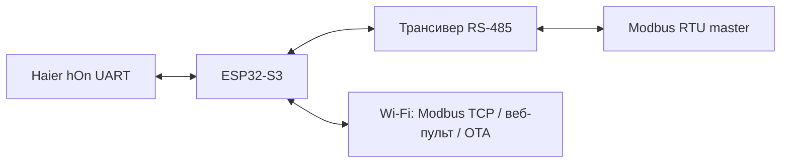

# Haier UART → Modbus · ESP32-S3

Локальный шлюз для кондиционера Haier: hOn UART ↔ Modbus RTU/RS-485 и Modbus TCP/Wi-Fi. Основан на открытом компоненте Haier для ESPHome. Облачная учётная запись не требуется.

Целевая плата: **ESP32-S3-WROOM-1-N16R8**. UART Haier — 9600 8N1. Основные адреса Modbus повторяют опубликованную карту **YCJ-A002**, дополнительные функции продолжают соответствующие таблицы. Это независимый проект, а не заводская прошивка или официальный продукт Haier. Совместимость с физическим YCJ-A002 кондиционеру не требуется.



## Возможности

- Локальный веб-пульт: включение/выключение, температура, режим, вентилятор, обе оси жалюзи, турбо/сон, тихий режим, дисплей и фиксированные положения жалюзи.
- Первичная настройка Wi-Fi через собственную точку доступа; сохранение сети, повторное подключение и резервная точка доступа.
- ArduinoOTA с паролем.
- MQTT-клиент внешнего брокера через Wi-Fi: состояние, команды, Last Will, обнаружение Home Assistant и отдельный выключатель на `/mqtt`.
- Одна карта регистров и один арбитр команд для Modbus RTU и TCP.
- **RTU и TCP включаются независимо**, настройки сохраняются. Оба по умолчанию выключены; веб-пульт и OTA продолжают работать.
- Подтверждение команды по двум новым status-пакетам hOn. Чтение Modbus показывает полученное состояние, не желаемое.

## Версия 0.6.0

Перенесены функции ESP8266 v0.5.1: пульт с подтверждением команд, общее меню, обзор, MQTT, Wi-Fi и «О системе». В S3 дополнительно сохранены Modbus RTU/TCP и отображение PSRAM. Страницы передаются из flash частями. Сброс Wi-Fi доступен отдельно и сохраняет настройки протоколов.

Сборка и программные тесты пройдены. Версия 0.6.0 ещё не загружена на S3: реальный hOn, MQTT/HA, RS-485 и память во время работы предстоит проверить на подготовленной плате.

## Сборка

1. Установить Python 3.11 и Git.
2. Скопировать `secrets.example.yaml` в `secrets.yaml`, задать свои пароли.
3. На Windows выполнить `./Build.ps1`. Либо:

```sh
python -m venv .venv
# activate the environment for your shell
python -m pip install -r requirements.txt
python -m esphome compile haier-s3.yaml
```

Зависимости закреплены: ESPHome2026.6.5, HaierProtocol0.9.31. Сборка не запускает прошивку устройства. Конфигурация рассчитана на 16MB Flash и8MB octal PSRAM; это не образ для ESP8266 или одноядерного ESP32-S0WD.

## Первый запуск

Аппаратное подключение: [HARDWARE.md](docs/HARDWARE.md). После прошивки подключиться к точке `haier-s3-<suffix>-setup` с паролем `setup_password`, открыть `http://192.168.4.1`, выбрать сеть2.4GHz. После получения адреса открыть `/control`. Логин `admin`, пароль — `ota_password` из локального `secrets.yaml` (в этой версии общий для web/OTA).

Страница `/wifi/reset` забывает сохранённую сеть и возвращает точку первоначальной настройки, сохраняя MQTT/Modbus и пароли управления.

Страница `/modbus` позволяет включать RTU/TCP, выбирать Unit ID и скорость RTU. TCP работает на порту502 через основное Wi-Fi-подключение; подключения с setup AP отклоняются. Modbus TCP не имеет аутентификации и рассчитан на доверенную локальную сеть.

## Документация

- [Карта регистров](docs/REGISTERS.md), [CSV](docs/registers.csv), [заводские источники](docs/sources/README.md).
- [Сборка стенда](docs/HARDWARE.md).
- [API и подтверждение команд](docs/API.md), [MQTT](docs/MQTT.md).
- [Журнал версий](CHANGELOG.md).
- [Проверки и ограничения](docs/VALIDATION.md).
- [Лицензии и происхождение](THIRD_PARTY_NOTICES.md).

## Статус

Исходная ESP8266-реализация проверена с Haier AS25HSL1HRA-W. **Перенос на ESP32-S3 и обмен Modbus требуют проверки на новом стенде**: успешная сборка и тесты пакетов не заменяют проверки электрического интерфейса и реального клиента. Блокировка и соответствие ненулевых кодов ошибок YCJ-A002 отдельно не подтверждены.

## Лицензирование

Новый самостоятельный код шлюза и документация — **MIT**. Заимствованный C++ компонент ESPHome — **GPL-3.0**; распространяемая связанная прошивка должна учитывать GPLv3. Репозиторий имеет смешанное лицензирование, подробности в [THIRD_PARTY_NOTICES.md](THIRD_PARTY_NOTICES.md). Заводские прошивки Haier в него не включены.
