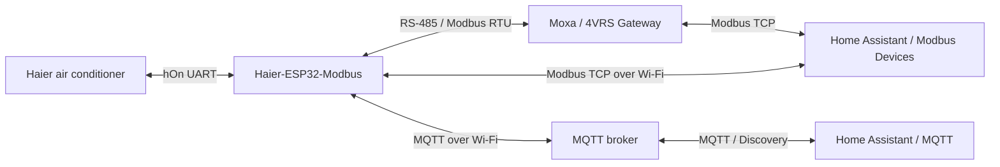
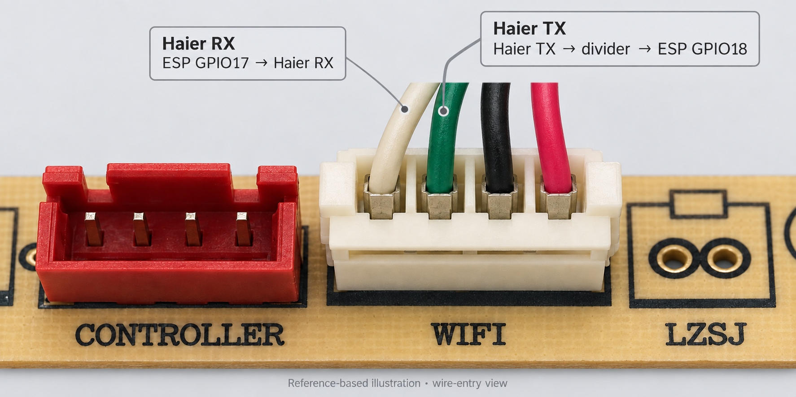
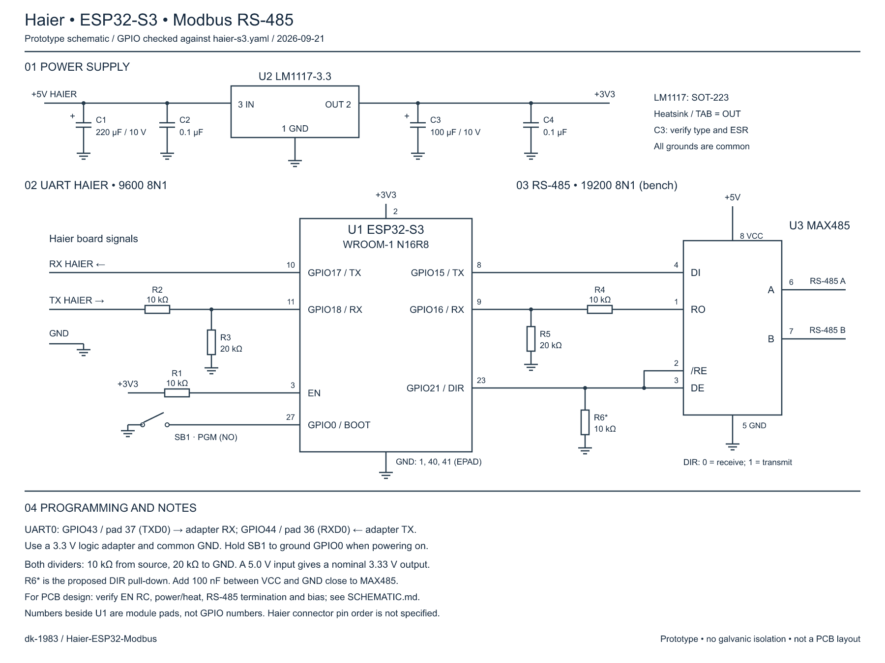

[English](README.md) | [Русский](README_RU.md)


<a id="haier-в-home-assistant--mqtt-и-modbus--esp32-s3"></a>

# Haier in Home Assistant · MQTT and Modbus · ESP32-S3

**Our ESP32-S3 controller replaces the original Haier Wi-Fi module and connects to its UART connector on the indoor unit's main board.** It exchanges commands and status with the air conditioner through this connector. Follow the [project schematic](#electrical-schematic) for power and UART level conversion; verify the connector pinout for your model.

**Bring your Haier air conditioner into your smart home: Home Assistant controls, schedules and automations using your own sensors — locally, without a Haier cloud account.** The firmware bridges the air conditioner's UART to MQTT over Wi-Fi and automatically announces climate controls, quiet mode, display and louvre positions to Home Assistant.

For MQTT, you need an ESP32-S3, power supply and UART level conversion, Wi-Fi and an MQTT broker. MAX485 and Moxa are used for the RS-485 option. The web panel provides setup and direct browser control. Modbus installations can use TCP/RTU, the ready-made **Modbus Devices** profile and **4VRS Gateway on Moxa**.

**[Install the firmware, step by step](docs/FLASHING.md)** · **[Connect using MQTT](#home-assistant-via-mqtt)** · **[Connect using Modbus Devices](#ready-made-home-assistant-integration)** · **[Build the firmware](#build)** · **[Electrical schematic](#electrical-schematic)**

Tested hardware: **ESP32-S3-WROOM-1 N16R8 + Haier AS25HSL1HRA-W**. Other models require UART and protocol compatibility checks.

**Project foundation:** Haier protocol integration is based on [paveldn/haier-esphome](https://github.com/paveldn/haier-esphome) by Pavlo Dudnytskyi. This firmware uses the Haier component from ESPHome 2026.6.5 with local changes and HaierProtocol 0.9.31. Our web management, MQTT bridge and Modbus interfaces build on that foundation. See [provenance and licenses](THIRD_PARTY_NOTICES.md).

## New in v1.1.0

**[Download the ready-to-flash release](https://github.com/dk-1983/Haier-ESP32-Modbus/releases/tag/v1.1.0)** — factory and OTA binaries for ESP32-S3 N16R8, checksums and [step-by-step installation](docs/FLASHING.md). Compiling the firmware yourself is optional.

- **Personal passwords from the browser:** change web access, ArduinoOTA and setup Wi-Fi passwords independently on `/settings`. Existing provisioned passwords and settings survive firmware updates; new public installations ask you to create personal passwords first.
- **Updates directly from GitHub:** the controller checks for new stable releases and can install them automatically. Enable or disable installation, check for a release or start an update from `/updates`.
- **Verified update files:** firmware checks the release signature, target board and file hash before selecting the new image. See [passwords, updates and recovery limits](docs/MANAGEMENT.md).

The public v1.1.0 binary was installed on the operating Haier controller through GitHub OTA; access and cooling settings were preserved. [Acceptance checks](docs/VALIDATION-1.1.0.md).

<a id="home-assistant-через-mqtt"></a>

## Home Assistant via MQTT

**Connect the controller to your MQTT broker and the firmware will publish its device and control definitions to Home Assistant.** This brings local Wi-Fi control, automations and air conditioner status into your smart home. This option requires an MQTT broker and Home Assistant's MQTT integration; Modbus Devices and an RS-485 gateway are not required.

<a id="что-появляется-автоматически"></a>

### Automatically discovered entities

MQTT Discovery groups five entities under the **Haier S3** device:

| Entity | Capabilities |
|---|---|
| Climate | Power, cooling, heating, dry, fan-only and auto; 16–30 °C setpoint and current temperature; fan speed; single-axis or both-axis swing; boost and sleep |
| Quiet mode | Separate Quiet switch |
| Display | Air conditioner display on/off |
| Vertical louvre position | Select a fixed up/down position |
| Horizontal louvre position | Select a fixed left/right position |

Add these entities to your dashboard and automations: schedule setpoints, enable quiet mode in the evening, turn off the display at night or control server-room cooling using sensors.

MQTT exposes **all implemented control commands**, including locking, plus telemetry and command confirmation in state/result topics. Lock and additional diagnostic entities are not discovered automatically; configure them separately using the [topic reference](docs/MQTT.md#topics).

<a id="как-подключить"></a>

### Connection steps

1. Set up an MQTT broker and connect Home Assistant's **MQTT** integration to it with discovery enabled.
2. Open **`/mqtt`** on the controller. Enter the broker address, port (usually **1883**), credentials and a unique topic prefix for this controller.
3. Enable **MQTT** and **Home Assistant discovery**, then save. MQTT starts disabled; Discovery is enabled by default.
4. Once connected, find **Haier S3** in the MQTT integration and add its entities to your dashboard. The controller needs fresh air conditioner data for controls to be available.

MQTT can run alongside Modbus RTU/TCP and the web panel. All interfaces share a command arbiter: while one command awaits confirmation, another may be rejected as `busy`. Send automation commands sequentially, **without retain**.

The firmware publishes actual Haier state and command results. In the current Discovery definitions, Quiet and Display switches use optimistic indication, subsequently corrected by telemetry; other entities do not. A series of **41 MQTT commands** was confirmed by a real air conditioner, and all five Discovery configurations reached the broker. A separate Home Assistant UI test with ESP32-S3 was not part of that series.

**[MQTT setup, commands, diagnostics and connection recovery →](docs/MQTT.md)**

<a id="готовая-интеграция-с-home-assistant"></a>

## Ready-made Home Assistant integration

**A ready-made solution is available for anyone building this project: [Modbus Devices](https://github.com/dk-1983/Modbus_Devices#4vrs), version 1.3.0 or later, with a dedicated 4VRS Haier-ESP32 profile.** No manual register definitions in Home Assistant are required.

The profile provides power, mode, temperature, fan, swing and preset controls; separate quiet/display switches; fixed louvre positions; and link/command diagnostics. State updates follow controller confirmation and readback.

1. Install or update **Modbus Devices** through HACS and restart Home Assistant. [Installation guide](https://github.com/dk-1983/Modbus_Devices#installation).
2. Open `/modbus` on the ESP and enable **TCP** for direct Wi-Fi access or **RTU** for RS-485.
3. Add the **Modbus Devices** integration and a new hub. Select manufacturer **4VRS**, model **Haier-ESP32**.
4. For direct access, select **Modbus TCP/IP**, the controller IP, port **502** and its Unit ID. For **Moxa / 4VRS Gateway**, use the gateway address/port and match its transport mode — [connection options](docs/SYSTEM.md#2-choose-the-connection-path).

Modbus Devices also includes a dashboard device-card generator. The original Haier YCJ-A002 profile remains separate; select **4VRS Haier-ESP32** for this project's extended features.

According to Modbus Devices documentation, full hardware validation of the extended profile is planned with the production PCB. Completed firmware and bench checks are listed separately in [VALIDATION.md](docs/VALIDATION.md).

<a id="полная-система-4vrs"></a>

## The complete 4VRS system



| Component | Role | Source and documentation |
|---|---|---|
| Air conditioner controller | Haier telemetry, commands, web panel, Modbus RTU/TCP, MQTT and OTA | **[Haier-ESP32-Modbus](https://github.com/dk-1983/Haier-ESP32-Modbus)** — this repository |
| RS-485 network gateway | Serial-to-network connection, port configuration and diagnostics | **[Moxa / 4VRS Gateway](https://github.com/dk-1983/moxa-4vrs-gateway)** |
| Home Assistant control | Ready-made **4VRS Haier-ESP32** profile: climate, extended features and diagnostics | **[Modbus Devices](https://github.com/dk-1983/Modbus_Devices)** |

**[Build the complete system →](docs/SYSTEM.md)** — hardware, connection options, setup of the three projects and verification. ESP connects directly to Modbus Devices over Wi-Fi; the RS-485 option uses Moxa.

Modbus Devices and Moxa participated in our bench tests. See the [validation report](docs/VALIDATION.md#systems-used-in-validation) for the tested path and results.

Target: **ESP32-S3-WROOM-1-N16R8**. Tested AC: **Haier AS25HSL1HRA-W**, UART 9600 8N1. Base Modbus addresses follow **YCJ-A002**; extensions continue the respective tables. A physical YCJ-A002 adapter is not required. This is an independent project, not an official Haier product.

<a id="возможности"></a>

## Features

- External MQTT broker over Wi-Fi: state, commands, Last Will, Home Assistant discovery and an independent switch at `/mqtt`.
- Local web panel: power, temperature, mode, fan, both swing axes, boost/sleep, quiet, display and fixed louvre positions.
- Wi-Fi setup through the controller's access point, saved networks, reconnection and fallback access point.
- Password-protected ArduinoOTA.
- Shared register map and command arbiter for Modbus RTU and TCP.
- **RTU and TCP can be enabled independently**, with saved settings. Both default to off; web control and OTA remain available.
- Commands confirmed by two new matching hOn status packets. Modbus reads report observed state, not requested state.

<a id="версия-100"></a>

## Version 1.0.0

Validated: ESP32-S3 N16R8, Haier AS25HSL1HRA-W communication through level conversion, web commands confirmed by actual state, and bench RS-485. Fixed memory corruption when copying hOn sensors and a watchdog reset during ArduinoOTA. Results and limits: [VALIDATION.md](docs/VALIDATION.md).

**[v1.1.0 includes ready-to-flash binaries](https://github.com/dk-1983/Haier-ESP32-Modbus/releases/tag/v1.1.0)** for ESP32-S3 N16R8: `-factory.bin` for first USB-UART installation at 0x0 and `-ota.bin` for ArduinoOTA. No compilation is required. The public image asks you to set personal passwords on first boot. [Password changes and GitHub auto-updates](docs/MANAGEMENT.md) are available in the web interface. v1.0.0 remains source-only.

**[Install the firmware, step by step](docs/FLASHING.md)** — download binary → USB-UART → BOOT → flash → personal passwords → Wi-Fi → OTA.

<a id="сборка"></a>

## Build

1. Install Python 3.11 and Git.
2. Copy `secrets.example.yaml` to `secrets.yaml` and set your passwords.
3. On Windows run `./Build.ps1`, or:

```sh
python -m venv .venv
# activate the environment for your shell
python -m pip install -r requirements.txt
python -m esphome compile haier-s3.yaml
```

Pinned dependencies: ESPHome 2026.6.5, HaierProtocol 0.9.31. Building does not flash a device. The configuration targets 16 MB Flash and 8 MB octal PSRAM; it is not an image for ESP8266 or single-core ESP32-S0WD.

<a id="электрическая-схема"></a>

## Haier Wi-Fi connector



Reference-based illustration of our **AS25HSL1HRA-W** board, viewed from the wire-entry side with `WIFI` below the connector. The adjacent red `CONTROLLER` socket identifies the left side. This is a rendered illustration, not a dimensional drawing. [Original close-up](docs/assets/haier-wifi-connector-photo-7.jpeg) · [Board context](docs/assets/haier-wifi-connector-photo-6.jpeg).

The builder confirmed the signal and power wires; **TX/RX refer to the Haier board**:

| Wire on this harness | Haier signal | ESP32-S3 connection |
|---|---|---|
| White, leftmost in this view | RX | GPIO17 (ESP TX) → Haier RX |
| Green, second from the left | TX | Haier TX → R2/R3 voltage divider → GPIO18 (ESP RX) |
| Black, third from the left | Power − / GND | Common circuit ground |
| Red, rightmost | Power + | Controller power input, before the 3.3 V regulator |

From left to right in this view: **white RX, green TX, black GND, red power +**. The ESP32-S3 supply is 3.3 V from the regulator; the red wire is not connected directly to the module’s 3V3 pin. Wire colors describe this particular harness, not a universal Haier pinout. Connect power and ground according to the verified schematic; the photo/render does not establish a connector part number or contact pitch.

## Electrical schematic



[Open SVG](docs/assets/haier-s3-schematic-en.svg) · [Values, verified pins and notes](docs/SCHEMATIC.md). Both RX inputs use 10/20 kΩ dividers; module pad numbers are shown separately from GPIO numbers.

<a id="сборка-для-mqtt-без-rs-485"></a>

### MQTT build without RS-485

**For Home Assistant over MQTT, you can omit the entire “03 RS-485” section.** Do not install **U3 (MAX485), R4, R5, R6**, the local MAX485 supply capacitor or A/B connector. Connections from that section to GPIO15, GPIO16 and GPIO21 are unnecessary.

Keep the ESP32-S3, supply, EN/BOOT circuits and Haier UART: **GPIO17 → Haier RX**, **Haier TX → R2/R3 divider → GPIO18**, and common ground. **Keep R2 and R3**: they convert the air conditioner's input signal level and are not part of RS-485.

Use the same main `haier-s3.yaml` firmware; no separate build is needed. Leave **RTU disabled** at `/modbus`, and enable MQTT/Discovery at `/mqtt`. The web panel and OTA remain available. **Modbus TCP over Wi-Fi also works without MAX485** if you later choose Modbus Devices.

<a id="первый-запуск"></a>

## First start

Hardware connections: [HARDWARE.md](docs/HARDWARE.md). After flashing, join `haier-s3-<suffix>-setup` using `Haier-Setup` for a fresh public binary (or your saved setup password), open `http://192.168.4.1` and select a 2.4 GHz network. Once the ESP has an address, open `/control`. Username: `admin`. Public v1.1.0 first asks you to set personal passwords at `/settings`; existing provisioned devices keep their saved credentials. Private builds migrate `ota_password` as the initial web/OTA password. Afterwards web and OTA passwords can be changed independently.

The `/wifi/reset` page forgets saved networks and returns to setup mode while retaining MQTT/Modbus settings and control passwords.

At `/modbus`, enable RTU/TCP and choose Unit ID and RTU baud rate. TCP listens on port 502 over the main Wi-Fi connection; setup-AP connections are rejected. Modbus TCP has no authentication and is intended for a trusted local network.

<a id="документация"></a>

## Documentation

- **[Complete system: hardware to Home Assistant](docs/SYSTEM.md).**
- [Register map](docs/REGISTERS.md), [CSV](docs/registers.csv), [manufacturer sources](docs/sources/README.md).
- [Bench hardware](docs/HARDWARE.md).
- [API and command confirmation](docs/API.md), [MQTT](docs/MQTT.md).
- [Changelog](CHANGELOG.md).
- [Validation and limitations](docs/VALIDATION.md).
- [Licenses and provenance](THIRD_PARTY_NOTICES.md).

<a id="статус"></a>

## Status

Working release for the tested Haier AS25HSL1HRA-W and ESP32-S3 N16R8. Other models require protocol and electrical checks. Equivalence of nonzero fault codes to YCJ-A002 is unverified. The project does not replace the air conditioner's protective functions.

[v1.1.0 acceptance checks](docs/VALIDATION-1.1.0.md)
