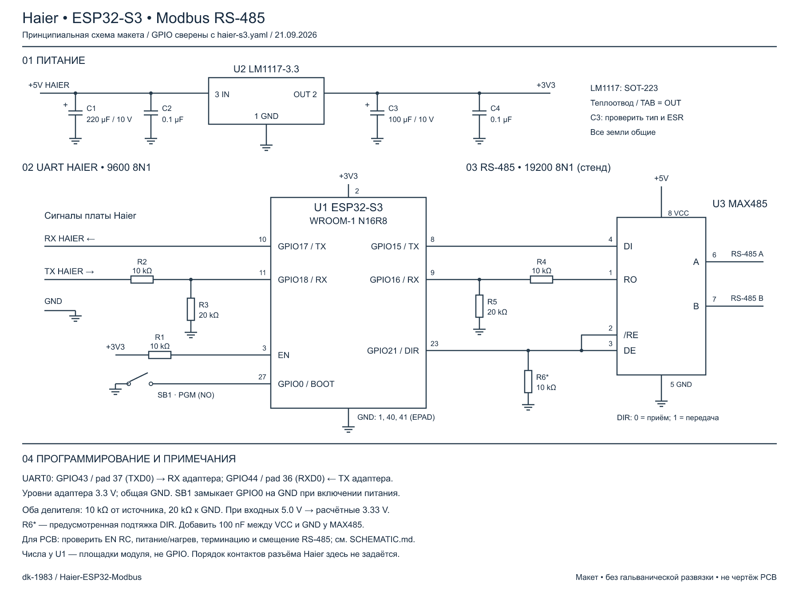

# Haier UART → Modbus · ESP32-S3

**От кондиционера Haier до управления в Home Assistant — одна система из наших открытых проектов.** Здесь находится прошивка ESP32-S3, которая связывает hOn UART кондиционера с локальным управлением, Modbus и MQTT. Сетевой путь через RS-485 обеспечивает **4VRS Gateway на Moxa**, а управление в Home Assistant — **Modbus Devices**. Облачная учётная запись Haier не требуется.

## Полная система 4VRS


| Часть системы | Что она даёт | Исходники и документация |
|---|---|---|
| Контроллер кондиционера | Чтение состояния Haier, команды, веб-пульт, Modbus RTU/TCP, MQTT и OTA | **[Haier-ESP32-Modbus](https://github.com/dk-1983/Haier-ESP32-Modbus)** — этот репозиторий |
| Сетевой шлюз RS-485 | Соединение последовательной линии с сетью, настройка портов и диагностика | **[Moxa / 4VRS Gateway](https://github.com/dk-1983/moxa-4vrs-gateway)** |
| Управление в Home Assistant | Интеграция Modbus и профиль YCJ-A002 для базовых параметров кондиционера | **[Modbus Devices](https://github.com/dk-1983/Modbus_Devices)** |

**[Начать сборку всей системы →](docs/SYSTEM.md)** — состав оборудования, выбор подключения, настройка трёх проектов и проверка результата. Для подключения по Wi-Fi ESP работает с Modbus Devices напрямую; Moxa используется в варианте с RS-485.

Modbus Devices и Moxa участвовали в наших стендовых проверках. Состав проверенного тракта и результаты приведены в [отчёте испытаний](docs/VALIDATION.md#системы-использованные-в-проверках).

Целевая плата: **ESP32-S3-WROOM-1-N16R8**. Проверенный кондиционер: **Haier AS25HSL1HRA-W**, UART 9600 8N1. Основные адреса Modbus повторяют карту **YCJ-A002**, дополнительные функции продолжают соответствующие таблицы. Физический адаптер YCJ-A002 для этой схемы не требуется. Это независимый проект, не официальный продукт Haier.

## Возможности

- Локальный веб-пульт: включение/выключение, температура, режим, вентилятор, обе оси жалюзи, турбо/сон, тихий режим, дисплей и фиксированные положения жалюзи.
- Первичная настройка Wi-Fi через собственную точку доступа; сохранение сети, повторное подключение и резервная точка доступа.
- ArduinoOTA с паролем.
- MQTT-клиент внешнего брокера через Wi-Fi: состояние, команды, Last Will, обнаружение Home Assistant и отдельный выключатель на `/mqtt`.
- Одна карта регистров и один арбитр команд для Modbus RTU и TCP.
- **RTU и TCP включаются независимо**, настройки сохраняются. Оба по умолчанию выключены; веб-пульт и OTA продолжают работать.
- Подтверждение команды по двум новым status-пакетам hOn. Чтение Modbus показывает полученное состояние, не желаемое.

## Версия 1.0.0

Проверены ESP32-S3 N16R8, обмен с Haier AS25HSL1HRA-W через согласование уровней, веб-команды с подтверждением фактическим состоянием и стендовый RS-485. Исправлены повреждение памяти при копировании датчиков hOn и перезапуск watchdog во время ArduinoOTA. Подробные результаты и границы проверок: [VALIDATION.md](docs/VALIDATION.md).

Релиз содержит исходники. Собирайте прошивку со своими паролями: готовый образ с индивидуальными учётными данными не публикуется.

## Сборка

1. Установить Python 3.11 и Git.
2. Скопировать `secrets.example.yaml` в `secrets.yaml`, задать свои пароли.
3. На Windows выполнить `./Build.ps1`. Либо:

```sh
python -m venv .venv
# activate the environment for your shell
python -m pip install -r requirements.txt
python -m esphome compile haier-s3.yaml
```

Зависимости закреплены: ESPHome2026.6.5, HaierProtocol0.9.31. Сборка не запускает прошивку устройства. Конфигурация рассчитана на 16MB Flash и8MB octal PSRAM; это не образ для ESP8266 или одноядерного ESP32-S0WD.

## Электрическая схема



[Открыть SVG](docs/assets/haier-s3-schematic.svg) · [Номиналы, проверка пинов и примечания](docs/SCHEMATIC.md). Оба входа RX защищены делителями 10/20 кОм; номера площадок модуля подписаны отдельно от GPIO.

## Первый запуск

Аппаратное подключение: [HARDWARE.md](docs/HARDWARE.md). После прошивки подключиться к точке `haier-s3-<suffix>-setup` с паролем `setup_password`, открыть `http://192.168.4.1`, выбрать сеть2.4GHz. После получения адреса открыть `/control`. Логин `admin`, пароль — `ota_password` из локального `secrets.yaml` (в этой версии общий для web/OTA).

Страница `/wifi/reset` забывает сохранённую сеть и возвращает точку первоначальной настройки, сохраняя MQTT/Modbus и пароли управления.

Страница `/modbus` позволяет включать RTU/TCP, выбирать Unit ID и скорость RTU. TCP работает на порту502 через основное Wi-Fi-подключение; подключения с setup AP отклоняются. Modbus TCP не имеет аутентификации и рассчитан на доверенную локальную сеть.

## Документация

- **[Вся система: от оборудования до Home Assistant](docs/SYSTEM.md).**
- [Карта регистров](docs/REGISTERS.md), [CSV](docs/registers.csv), [заводские источники](docs/sources/README.md).
- [Сборка стенда](docs/HARDWARE.md).
- [API и подтверждение команд](docs/API.md), [MQTT](docs/MQTT.md).
- [Журнал версий](CHANGELOG.md).
- [Проверки и ограничения](docs/VALIDATION.md).
- [Лицензии и происхождение](THIRD_PARTY_NOTICES.md).

## Статус

Рабочая версия для проверенной модели Haier AS25HSL1HRA-W и ESP32-S3 N16R8. Другие модели требуют проверки протокола и электрических уровней. Соответствие ненулевых кодов неисправности заводскому YCJ-A002 не подтверждено. Проект не заменяет защитные функции кондиционера.
