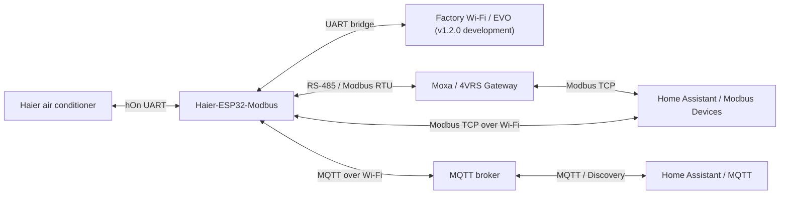
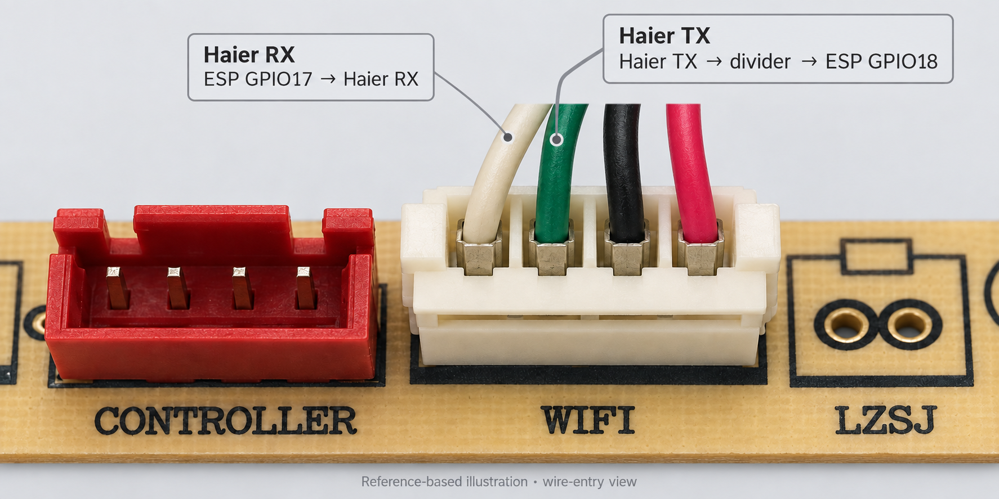
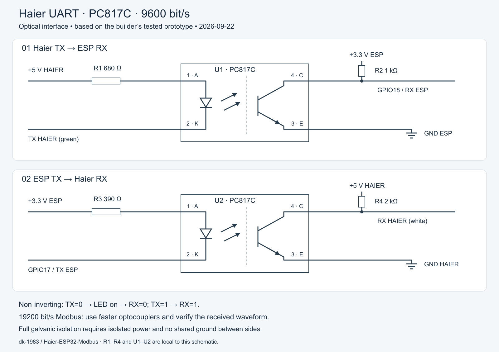

[English](README.md) | [Русский](README_RU.md)


<a id="haier-в-home-assistant--mqtt-и-modbus--esp32-s3"></a>

# Haier in Home Assistant · MQTT and Modbus · ESP32-S3

**Keep the factory controls. Add local automation.** Haier-ESP32-Modbus connects your air conditioner to Home Assistant and building automation through **Modbus Devices, MQTT and Modbus RTU/TCP**, with a local web panel for setup and direct control.

The new **transparent UART bridge in development v1.2.0** places our ESP32-S3 between the indoor unit's main board and its original Wi-Fi module. The factory module stays in the system: the bridge forwards its UART exchanges and coordinates our own requests alongside them. This lets you add local control while retaining the equipment's original control path.

**Version v1.2.0:** the inline UART bridge retains factory Wi-Fi connectivity and adds local control. Ready-to-flash factory/OTA binaries, wiring and instructions are available in the [release](https://github.com/dk-1983/Haier-ESP32-Modbus/releases/tag/v1.2.0). Check the changed RS-485 pinout before upgrading from v1.1.0; the main-board GPIO17/18 wiring is unchanged.

## Factory functionality, with more ways to control it

For owners who want to retain their air conditioner's original equipment, the bridge is the key addition. It preserves the connection to the factory Wi-Fi module rather than requiring its removal from the system. On our Haier AS25HSL1HRA-W, factory-module pairing in **EVO** and setpoint changes through the factory app have been confirmed with the bridge connected. Our controller also receives the appliance state for local interfaces.

The factory app continues to use its own service; local MQTT, Modbus and web control do not require a Haier cloud account. The bridge operates on the Wi-Fi UART connection, without replacing the indoor unit's main controller, display or IR receiver. Compatibility with every model, factory command or update is not implied: see the [bridge design and acceptance record](docs/UART_BRIDGE.md).

| Connection | What you get | What you need |
|---|---|---|
| **Modbus Devices → Home Assistant** | Ready-made **4VRS Haier-ESP32** profile, climate controls, extended functions and diagnostics | Modbus Devices and a direct Modbus TCP connection over Wi-Fi; no MQTT broker or MAX485 required for this path |
| **MQTT → Home Assistant** | Automatic entity discovery, local control and automations | An MQTT broker and Home Assistant's MQTT integration |
| **RS-485 / Modbus RTU** | Connection to industrial controllers, BMS/SCADA or a network gateway | An RS-485 transceiver; Moxa / 4VRS Gateway is an optional network connection |
| **Local web panel** | Setup, direct control, passwords and firmware updates | A browser on the local network |

**A complete route from the DIY controller to Home Assistant:** use our [Modbus Devices integration](https://github.com/dk-1983/Modbus_Devices#4vrs) and select **4VRS → Haier-ESP32**. You do not have to describe registers manually. For installations with RS-485, our [Moxa / 4VRS Gateway](https://github.com/dk-1983/moxa-4vrs-gateway) completes the network path. [Connection guide →](docs/SYSTEM.md)

For a Wi-Fi-only build, leave out the MAX485/RS-485 section. Both arrangements need ESP32-S3 power and UART level conversion according to the appropriate schematic. The bridge arrangement also needs the factory-module UART connection.

**[Modbus Devices setup](#ready-made-home-assistant-integration)** · **[How the UART bridge works](docs/UART_BRIDGE.md)** · **[MQTT setup](#home-assistant-via-mqtt)** · **[Flash the firmware](docs/FLASHING.md)** · **[Bridge schematic](docs/assets/haier-uart-bridge-schematic.svg)** · **[Electrical schematic](#electrical-schematic)**

Tested hardware: **ESP32-S3-WROOM-1 N16R8 + Haier AS25HSL1HRA-W**. Other models require UART and protocol compatibility checks.

**Project foundation:** Haier protocol integration is based on [paveldn/haier-esphome](https://github.com/paveldn/haier-esphome) by Pavlo Dudnytskyi. This firmware uses the Haier component from ESPHome 2026.6.5 with local changes and HaierProtocol 0.9.31. Our web management, MQTT bridge and Modbus interfaces build on that foundation. See [provenance and licenses](THIRD_PARTY_NOTICES.md).

**Verified on our installation:** 30-minute coexistence, automatic direct polling without the factory module and automatic bridge return. The public binary was separately exercised through MQTT, web controls and Modbus TCP. Physical RS-485 on GPIO8/9 awaits the MAX485 board. [Results and limitations](docs/VALIDATION-1.2.0.md).

## New in v1.2.0

**[Download the ready-to-flash release](https://github.com/dk-1983/Haier-ESP32-Modbus/releases/tag/v1.2.0)** — factory and OTA binaries for ESP32-S3 N16R8, checksums and [step-by-step installation](docs/FLASHING.md). Compiling the firmware yourself is optional.

- **Factory Wi-Fi stays connected:** the new UART bridge links the Haier main board and original module; local controls complement factory control. Without the factory module, firmware falls back to direct polling.
- **Existing integrations retained:** Modbus registers, MQTT and Home Assistant discovery remain compatible; Modbus Devices provides a ready-made device profile.
- **Updated wiring:** Haier TX17/RX18; factory Wi-Fi TX16/RX15; Modbus TX9/RX8 and DE21. The first upgrade from v1.1.0 is manual after a wiring check; signed update profile v2 prevents automatic pinout migration.

- **Personal passwords from the browser:** change web access, ArduinoOTA and setup Wi-Fi passwords independently on `/settings`. Existing provisioned passwords and settings survive firmware updates; new public installations ask you to create personal passwords first.
- **Updates directly from GitHub:** the controller checks for new stable releases and can install them automatically. Enable or disable installation, check for a release or start an update from `/updates`.
- **Verified update files:** firmware checks the release signature, target board and file hash before selecting the new image. See [passwords, updates and recovery limits](docs/MANAGEMENT.md).

The public v1.1.0 binary was installed on the operating Haier controller through GitHub OTA; access and cooling settings were preserved. [Acceptance checks](docs/VALIDATION-1.1.0.md).

<a id="готовая-интеграция-с-home-assistant"></a>

## Ready-made Home Assistant integration

**A ready-made solution is available for anyone building this project: [Modbus Devices](https://github.com/dk-1983/Modbus_Devices#4vrs), version 1.3.0 or later, with a dedicated 4VRS Haier-ESP32 profile.** No manual register definitions in Home Assistant are required.

The profile provides power, mode, temperature, fan, swing and preset controls; separate quiet/display switches; fixed louvre positions; and link/command diagnostics. State updates follow controller confirmation and readback.

1. Install or update **Modbus Devices** through HACS and restart Home Assistant. [Installation guide](https://github.com/dk-1983/Modbus_Devices#installation).
2. Open `/modbus` on the ESP and enable **TCP** for direct Wi-Fi access or **RTU** for RS-485.
3. Add the **Modbus Devices** integration and a new hub. Select manufacturer **4VRS**, model **Haier-ESP32**.
4. For direct access, select **Modbus TCP/IP**, the controller IP, port **502** and its Unit ID. For **Moxa / 4VRS Gateway**, use the gateway address/port and match its transport mode — [connection options](docs/SYSTEM.md#2-choose-the-connection-path).

Modbus Devices also includes a dashboard device-card generator. The original Haier YCJ-A002 profile remains separate; select **4VRS Haier-ESP32** for this project's extended features.

According to Modbus Devices documentation, full hardware validation of the extended profile is planned with the production PCB. Completed firmware and bench checks are listed separately in [VALIDATION.md](docs/VALIDATION.md).

<a id="home-assistant-через-mqtt"></a>

## Home Assistant via MQTT

**Connect the controller to your MQTT broker and the firmware will publish its device and control definitions to Home Assistant.** This brings local Wi-Fi control, automations and air conditioner status into your smart home. This option requires an MQTT broker and Home Assistant's MQTT integration; Modbus Devices and an RS-485 gateway are not required.

<a id="что-появляется-автоматически"></a>

### Automatically discovered entities

MQTT Discovery groups five entities under the **Haier S3** device:

| Entity | Capabilities |
|---|---|
| Climate | Power, cooling, heating, dry, fan-only and auto; 16–30 °C setpoint and current temperature; fan speed; single-axis or both-axis swing; boost and sleep |
| Quiet mode | Separate Quiet switch |
| Display | Air conditioner display on/off |
| Vertical louvre position | Select a fixed up/down position |
| Horizontal louvre position | Select a fixed left/right position |

Add these entities to your dashboard and automations: schedule setpoints, enable quiet mode in the evening, turn off the display at night or control server-room cooling using sensors.

MQTT exposes **all implemented control commands**, including locking, plus telemetry and command confirmation in state/result topics. Lock and additional diagnostic entities are not discovered automatically; configure them separately using the [topic reference](docs/MQTT.md#topics).

<a id="как-подключить"></a>

### Connection steps

1. Set up an MQTT broker and connect Home Assistant's **MQTT** integration to it with discovery enabled.
2. Open **`/mqtt`** on the controller. Enter the broker address, port (usually **1883**), credentials and a unique topic prefix for this controller.
3. Enable **MQTT** and **Home Assistant discovery**, then save. MQTT starts disabled; Discovery is enabled by default.
4. Once connected, find **Haier S3** in the MQTT integration and add its entities to your dashboard. The controller needs fresh air conditioner data for controls to be available.

### Add the air conditioner dashboard card

Once MQTT Discovery is enabled, Home Assistant automatically creates the Haier entities, including a climate entity with standard controls. Open **Settings → Devices & services → MQTT → Haier S3** and select the climate entity to control the air conditioner. **No manual entity creation, YAML or separate Climate platform installation is needed to get started.**

**Optional:** to place a separate thermostat on your own dashboard, open **Edit dashboard → Add card → Manual** and paste:

```yaml
type: thermostat
entity: climate.haier_s3
name: Haier air conditioner
```

Select **Save**. This YAML belongs in the **dashboard card editor**, not Developer Tools Actions or Template, and not `configuration.yaml`.

`climate.haier_s3` is an example confirmed in the builder's installation. Renaming or other devices can change the entity ID. Find it under **Settings → Devices & services → MQTT → Haier S3**, or, only if you need to check the list of MQTT climate entities, open **Developer Tools → Template** and run:

```jinja
{{ integration_entities('mqtt') | select('match', '^climate[.]') | list }}
```

Choose the entity belonging to your device and use it in `entity`. An empty list `[]` means no MQTT climate entity was found; check Discovery and the HA log. If the entity exists but is unavailable, check the broker connection and fresh air conditioner UART data. `discovery_sent: 5` at **the controller's** `/mqtt/config` confirms delivery of five configurations to the broker, not their acceptance by Home Assistant. Sign in there using the ESP web-panel password.

### Room card: sensors and air conditioner together

**Optional dashboard layout, not a required MQTT setup step.** Use a `vertical-stack` to group a room's switches, temperature and humidity above the Haier thermostat. Paste the entire example into **Edit dashboard → Add card → Manual**.

This example uses the builder's balcony/server-room entities. **Replace switch and sensor IDs with your own**, remove unused rows and check `climate.haier_s3`. These sensors and switches are separate room devices; the Haier firmware does not create them.

```yaml
type: vertical-stack
cards:
  - type: entities
    title: balcony
    entities:
      - entity: switch.tasmota_7
      - entity: switch.tasmota2_6
      - entity: sensor.balcony_server_room_themperature_temperature
      - entity: sensor.balcony_server_room_themperature_humidity
      - entity: sensor.balcony_server_rack_temperature_temperature
      - entity: sensor.balcony_server_rack_temperature_humidity
      - entity: sensor.balcony_server_rack_temperature_2_temperature
      - entity: sensor.balcony_server_rack_temperature_2_humidity
      - entity: sensor.measuring_regulator_temperature_1

  - type: thermostat
    entity: climate.haier_s3
    name: Haier air conditioner
```

`entities` and `thermostat` are separate cards inside `cards`. Do not nest `type: thermostat` in the `entities` sensor list. Displaying them together does not change the air conditioner’s temperature source; control using an external sensor requires a separate automation.

MQTT can run alongside Modbus RTU/TCP and the web panel. All interfaces share a command arbiter: while one command awaits confirmation, another may be rejected as `busy`. Send automation commands sequentially, **without retain**.

The firmware publishes actual Haier state and command results. In the current Discovery definitions, Quiet and Display switches use optimistic indication, subsequently corrected by telemetry; other entities do not. A series of **41 MQTT commands** was confirmed by a real air conditioner, and all five Discovery configurations reached the broker. A separate Home Assistant UI test with ESP32-S3 was not part of that series.

**[MQTT setup, commands, diagnostics and connection recovery →](docs/MQTT.md)**

<a id="полная-система-4vrs"></a>

## The complete 4VRS system


```mermaid
flowchart LR
  AC["Haier air conditioner"] <-->|"hOn UART"| ESP["Haier-ESP32-Modbus"]
  ESP <-->|"UART bridge"| FACTORY["Factory Wi-Fi / EVO (v1.2.0 development)"]
  ESP <-->|"RS-485 / Modbus RTU"| MOXA["Moxa / 4VRS Gateway"]
  MOXA <-->|"Modbus TCP"| HA["Home Assistant / Modbus Devices"]
  ESP <-->|"Modbus TCP over Wi-Fi"| HA
  ESP <-->|"MQTT over Wi-Fi"| BROKER["MQTT broker"]
  BROKER <-->|"MQTT / Discovery"| HAMQTT["Home Assistant / MQTT"]
```

| Component | Role | Source and documentation |
|---|---|---|
| Air conditioner controller | Haier telemetry, commands, web panel, Modbus RTU/TCP, MQTT and OTA | **[Haier-ESP32-Modbus](https://github.com/dk-1983/Haier-ESP32-Modbus)** — this repository |
| RS-485 network gateway | Serial-to-network connection, port configuration and diagnostics | **[Moxa / 4VRS Gateway](https://github.com/dk-1983/moxa-4vrs-gateway)** |
| Home Assistant control | Ready-made **4VRS Haier-ESP32** profile: climate, extended features and diagnostics | **[Modbus Devices](https://github.com/dk-1983/Modbus_Devices)** |

**[Build the complete system →](docs/SYSTEM.md)** — hardware, connection options, setup of the three projects and verification. ESP connects directly to Modbus Devices over Wi-Fi; the RS-485 option uses Moxa.

Modbus Devices and Moxa participated in our bench tests. See the [validation report](docs/VALIDATION.md#systems-used-in-validation) for the tested path and results.

Target: **ESP32-S3-WROOM-1-N16R8**. Tested AC: **Haier AS25HSL1HRA-W**, UART 9600 8N1. Base Modbus addresses follow **YCJ-A002**; extensions continue the respective tables. A physical YCJ-A002 adapter is not required. This is an independent project, not an official Haier product.

<a id="возможности"></a>

## Features

- External MQTT broker over Wi-Fi: state, commands, Last Will, Home Assistant discovery and an independent switch at `/mqtt`.
- Local web panel: power, temperature, mode, fan, both swing axes, boost/sleep, quiet, display and fixed louvre positions.
- Wi-Fi setup through the controller's access point, saved networks, reconnection and fallback access point.
- Password-protected ArduinoOTA.
- Shared register map and command arbiter for Modbus RTU and TCP.
- **RTU and TCP can be enabled independently**, with saved settings. Both default to off; web control and OTA remain available.
- Commands confirmed by two new matching hOn status packets. Modbus reads report observed state, not requested state.

<a id="версия-100"></a>

## Version 1.0.0

Validated: ESP32-S3 N16R8, Haier AS25HSL1HRA-W communication through level conversion, web commands confirmed by actual state, and bench RS-485. Fixed memory corruption when copying hOn sensors and a watchdog reset during ArduinoOTA. Results and limits: [VALIDATION.md](docs/VALIDATION.md).

**[v1.2.0 includes ready-to-flash binaries](https://github.com/dk-1983/Haier-ESP32-Modbus/releases/tag/v1.2.0)** for ESP32-S3 N16R8: `-factory.bin` for first USB-UART installation at 0x0 and `-ota.bin` for ArduinoOTA. No compilation is required. The public image asks you to set personal passwords on first boot. [Password changes and GitHub auto-updates](docs/MANAGEMENT.md) are available in the web interface. v1.0.0 remains source-only.

**[Install the firmware, step by step](docs/FLASHING.md)** — download binary → USB-UART → BOOT → flash → personal passwords → Wi-Fi → OTA.

<a id="сборка"></a>

## Build

1. Install Python 3.11 and Git.
2. Copy `secrets.example.yaml` to `secrets.yaml` and set your passwords.
3. On Windows run `./Build.ps1`, or:

```sh
python -m venv .venv
# activate the environment for your shell
python -m pip install -r requirements.txt
python -m esphome compile haier-s3.yaml
```

Pinned dependencies: ESPHome 2026.6.5, HaierProtocol 0.9.31. Building does not flash a device. The configuration targets 16 MB Flash and 8 MB octal PSRAM; it is not an image for ESP8266 or single-core ESP32-S0WD.

<a id="электрическая-схема"></a>

## Haier Wi-Fi connector



Reference-based illustration of our **AS25HSL1HRA-W** board, viewed from the wire-entry side with `WIFI` below the connector. The adjacent red `CONTROLLER` socket identifies the left side. This is a rendered illustration, not a dimensional drawing. [Original close-up](docs/assets/haier-wifi-connector-photo-7.jpeg) · [Board context](docs/assets/haier-wifi-connector-photo-6.jpeg).

The builder confirmed the signal and power wires; **TX/RX refer to the Haier board**:

| Wire on this harness | Haier signal | ESP32-S3 connection |
|---|---|---|
| White, leftmost in this view | RX | GPIO17 (ESP TX) → Haier RX |
| Green, second from the left | TX | Haier TX → R2/R3 voltage divider → GPIO18 (ESP RX) |
| Black, third from the left | Power − / GND | Common circuit ground |
| Red, rightmost | Power + | Controller power input, before the 3.3 V regulator |

From left to right in this view: **white RX, green TX, black GND, red power +**. The ESP32-S3 supply is 3.3 V from the regulator; the red wire is not connected directly to the module’s 3V3 pin. Wire colors describe this particular harness, not a universal Haier pinout. Connect power and ground according to the verified schematic; the photo/render does not establish a connector part number or contact pitch.

## Electrical schematic

The current **v1.2.0 UART bridge schematic** keeps the main-board UART on GPIO17/18 and adds the factory Wi-Fi UART on GPIO16/15. RS-485 moves to GPIO9/8; direction control stays on GPIO21.


[Open full-size SVG](docs/assets/haier-uart-bridge-schematic.svg) · [Wiring, bridge operation and test results](docs/UART_BRIDGE.md).

The drawing includes 10/20 kΩ dividers on all three RX inputs, the GPIO21 pull-down, switchable 120 Ω RS-485 termination and programming UART. External-device TX/RX labels refer to those devices. Connect factory Wi-Fi through our ESP; do not connect its TX in parallel with the main-board TX.

**This is a new circuit schematic, not a new PCB layout.** The ordered **rev1.0** board remains unchanged: its RS-485 traces use GPIO15/16 and must be rerouted for v1.2.0 before connecting factory Wi-Fi. Physical RS-485 verification on GPIO8/9 awaits the MAX485 board; layout and Gerber files remain unpublished.

Previous bridge-free wiring for **v1.1.0**: [rev1.0 SVG](docs/assets/haier-schematic-rev1.0.svg) · [Values and notes](docs/SCHEMATIC.md).

### Optional optical UART



Two PC817C channels replace the direct TX wire and RX divider. Bench communication was confirmed at **9600 bit/s**. At **19200 bit/s Modbus**, the tested optocouplers distorted the rising edge: faster components and renewed verification are required. Full galvanic isolation also requires isolated power.

[Connections, values, SVG and oscilloscope result](docs/OPTICAL-UART.md).

<a id="сборка-для-mqtt-без-rs-485"></a>

### MQTT build without RS-485

**For Home Assistant over MQTT, omit the MAX485/RS-485 circuit if you do not need it.** In the new schematic this means U3, divider R6/R7, pull-down R8, termination R9 with JP1, capacitor C4 and the A/B connector. Its connections to GPIO8, GPIO9 and GPIO21 are unnecessary.

Keep ESP32-S3 power, EN/BOOT and the Haier UART: **GPIO17 → Haier RX**, **Haier TX → R4/R5 divider → GPIO18**, and common ground. To preserve factory Wi-Fi, also keep **GPIO16 → module RX** and **module TX → R3/R2 divider → GPIO15**. Retain both Haier UART dividers. Component references here belong to the new bridge schematic.

Use the same main `haier-s3.yaml` firmware; no separate build is needed. Leave **RTU disabled** at `/modbus`, and enable MQTT/Discovery at `/mqtt`. The web panel and OTA remain available. **Modbus TCP over Wi-Fi also works without MAX485** if you later choose Modbus Devices.

<a id="первый-запуск"></a>

## First start

Hardware connections: [v1.2.0 bridge](docs/UART_BRIDGE.md) and [electrical schematic](#electrical-schematic). After flashing, join `haier-s3-<suffix>-setup` using `Haier-Setup` for a fresh public binary (or your saved setup password), open `http://192.168.4.1` and select a 2.4 GHz network. Once the ESP has an address, open `/control`. Username: `admin`. The public binary first asks you to set personal passwords at `/settings`; existing provisioned devices keep their saved credentials. Private builds migrate `ota_password` as the initial web/OTA password. Afterwards web and OTA passwords can be changed independently.

The `/wifi/reset` page forgets saved networks and returns to setup mode while retaining MQTT/Modbus settings and control passwords.

At `/modbus`, enable RTU/TCP and choose Unit ID and RTU baud rate. TCP listens on port 502 over the main Wi-Fi connection; setup-AP connections are rejected. Modbus TCP has no authentication and is intended for a trusted local network.

<a id="документация"></a>

## Documentation

- **[Complete system: hardware to Home Assistant](docs/SYSTEM.md).**
- [Register map](docs/REGISTERS.md), [CSV](docs/registers.csv), [manufacturer sources](docs/sources/README.md).
- [Bench hardware](docs/HARDWARE.md).
- [API and command confirmation](docs/API.md), [MQTT](docs/MQTT.md).
- [Changelog](CHANGELOG.md).
- [Validation and limitations](docs/VALIDATION.md).
- [Licenses and provenance](THIRD_PARTY_NOTICES.md).

<a id="статус"></a>

## Status

Working release for the tested Haier AS25HSL1HRA-W and ESP32-S3 N16R8. Other models require protocol and electrical checks. Equivalence of nonzero fault codes to YCJ-A002 is unverified. The project does not replace the air conditioner's protective functions.

[v1.1.0 acceptance checks](docs/VALIDATION-1.1.0.md)

v1.3.0: [MQTT telemetry and server-room controller contract](docs/MQTT_TELEMETRY.md) adds observation freshness and AC fault discovery. See release notes for hardware validation status.
