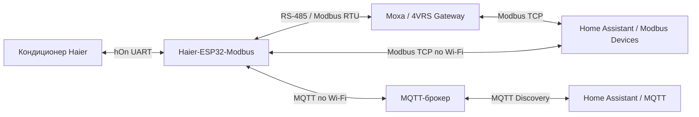
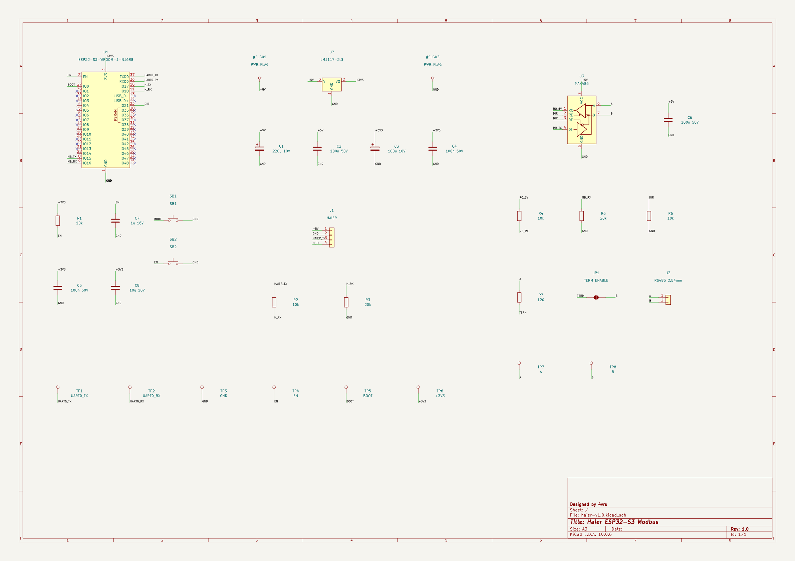
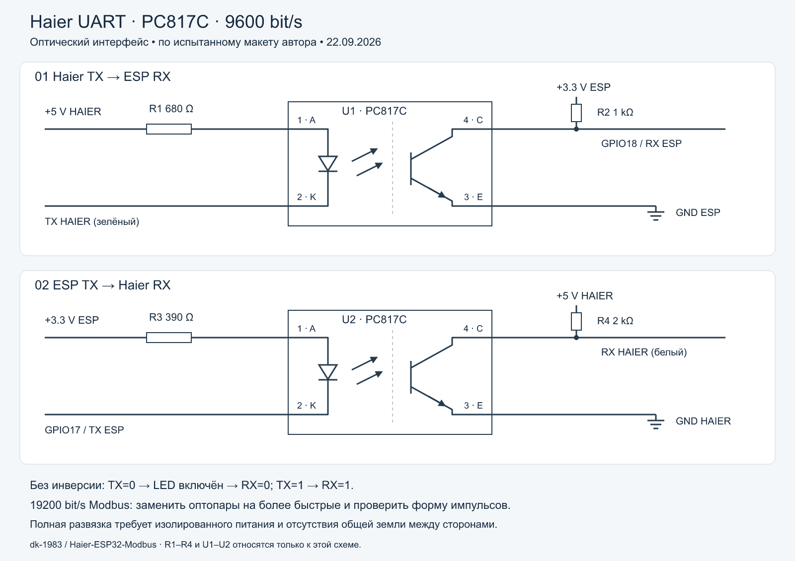

[English](README.md) | [Русский](README_RU.md)


# Haier в Home Assistant · MQTT и Modbus · ESP32-S3

**Наш контроллер на ESP32-S3 устанавливается вместо оригинального Wi-Fi-модуля Haier и подключается к предназначенному для него UART-разъёму на материнской плате внутреннего блока кондиционера.** Через этот разъём контроллер обменивается командами и состоянием с кондиционером. Питание и согласование уровней UART выполняются по [схеме проекта](#электрическая-схема); распиновку разъёма необходимо сверить для своей модели.

**Добавьте кондиционер Haier в свой умный дом: управление из Home Assistant, расписания и автоматизации по вашим датчикам — локально, без облачной учётной записи Haier.** Прошивка связывает UART кондиционера с MQTT по Wi-Fi и автоматически передаёт Home Assistant описание климатического устройства, тихого режима, дисплея и положений жалюзи.

Для MQTT-варианта нужны ESP32-S3, питание и согласование уровней UART, Wi-Fi и MQTT-брокер. MAX485 и Moxa нужны только при выборе RS-485. Веб-пульт помогает настроить контроллер и управлять кондиционером напрямую из браузера. Для систем с Modbus предусмотрены TCP/RTU, готовый профиль **Modbus Devices** и **4VRS Gateway на Moxa**.

**[Установка прошивки пошагово](docs/FLASHING_RU.md)** · **[Подключение через MQTT](#home-assistant-через-mqtt)** · **[Подключение через Modbus Devices](#готовая-интеграция-с-home-assistant)** · **[Сборка прошивки](#сборка)** · **[Электрическая схема](#электрическая-схема)**

Проверенная аппаратная связка: **ESP32-S3-WROOM-1 N16R8 + Haier AS25HSL1HRA-W**. Другие модели требуют проверки совместимости UART и протокола.

**Основа проекта:** интеграция с протоколом Haier основана на [paveldn/haier-esphome](https://github.com/paveldn/haier-esphome), автор — Pavlo Dudnytskyi. В прошивке используется компонент Haier из ESPHome 2026.6.5 с нашими изменениями и HaierProtocol 0.9.31. Поверх этой основы реализованы наше веб-управление, MQTT-шлюз и интерфейсы Modbus. См. [происхождение кода и лицензии](THIRD_PARTY_NOTICES_RU.md).

## Новое в v1.1.0

**[Скачать готовую прошивку](https://github.com/dk-1983/Haier-ESP32-Modbus/releases/tag/v1.1.0)** — factory- и OTA-бинарники для ESP32-S3 N16R8, контрольные суммы и [пошаговая инструкция установки](docs/FLASHING_RU.md). Самостоятельно компилировать проект необязательно.

- **Личные пароли из браузера:** на `/settings` независимо меняются пароли веб-интерфейса, ArduinoOTA и точки настройки Wi-Fi. Сохранённые пароли и настройки переживают обновления; при первой установке публичная прошивка предлагает задать личные пароли.
- **Обновления прямо с GitHub:** контроллер проверяет новые стабильные версии и может устанавливать их автоматически. На `/updates` можно включить или отключить установку, проверить наличие версии и запустить обновление вручную.
- **Проверка файлов обновления:** перед переключением на новую прошивку проверяются подпись релиза, совместимость платы и хеш файла. Подробнее: [пароли, обновления и ограничения восстановления](docs/MANAGEMENT_RU.md).

Публичная v1.1.0 установлена на работающий контроллер Haier через GitHub OTA; доступ и режим охлаждения сохранились. [Результаты приёмочных проверок](docs/VALIDATION-1.1.0_RU.md).

## Home Assistant через MQTT

**Подключите контроллер к своему MQTT-брокеру — прошивка сама передаст Home Assistant описание устройства и органов управления.** Так кондиционер становится частью умного дома: локальное управление по Wi-Fi, автоматизации и отображение состояния кондиционера. Для этого пути нужны MQTT-брокер и интеграция MQTT в Home Assistant; Modbus Devices и шлюз RS-485 не требуются.

### Что появляется автоматически

MQTT Discovery объединяет пять сущностей в устройство **Haier S3**:

| Сущность | Возможности |
|---|---|
| Климат | Включение/выключение, охлаждение, обогрев, осушение, вентиляция и авто; уставка 16–30 °C и текущая температура; скорость вентилятора; качание жалюзи по одной или обеим осям; турбо и сон |
| Тихий режим | Отдельный переключатель Quiet |
| Дисплей | Включение/выключение дисплея кондиционера |
| Вертикальное положение жалюзи | Выбор фиксированного положения вверх-вниз |
| Горизонтальное положение жалюзи | Выбор фиксированного положения влево-вправо |

Сущности можно добавить на панель Home Assistant и использовать в сценариях: менять уставку по расписанию, включать тихий режим вечером, выключать дисплей на ночь или управлять охлаждением серверной по датчикам.

Через MQTT доступны **все реализованные команды управления**, включая блокировку, а в топиках состояния и результата — телеметрия и подтверждение команд. Блокировка и дополнительные диагностические сущности автоматически не создаются: их можно подключить отдельно по [описанию топиков](docs/MQTT_RU.md#топики).

### Как подключить

1. Подготовьте MQTT-брокер и подключите к нему интеграцию **MQTT** в Home Assistant с включённым обнаружением устройств.
2. Откройте веб-страницу контроллера **`/mqtt`**. Укажите адрес брокера, порт (обычно **1883**), учётные данные и уникальный префикс топиков для этого контроллера.
3. Включите **MQTT** и **обнаружение Home Assistant**, сохраните настройки. MQTT изначально выключен; Discovery по умолчанию включён.
4. После подключения к брокеру найдите устройство **Haier S3** в интеграции MQTT и добавьте его сущности на панель. Для доступного управления контроллер должен получать свежие данные от кондиционера.

### Карточка кондиционера в Home Assistant

После включения MQTT Discovery Home Assistant автоматически создаёт сущности Haier, включая климатическую сущность со стандартным окном управления. Откройте **Настройки → Устройства и службы → MQTT → Haier S3** и выберите климатическую сущность: управление уже доступно. **Для начала работы вручную создавать сущности, писать YAML или устанавливать платформу Climate не нужно.**

**Необязательно:** если хотите разместить отдельный термостат на собственной панели, откройте **Редактировать панель → Добавить карточку → Вручную** и вставьте:

```yaml
type: thermostat
entity: climate.haier_s3
name: Кондиционер Haier
```

Нажмите **Сохранить**. Это YAML **карточки панели**, не для вкладок «Действия» или «Шаблоны» и не для `configuration.yaml`.

`climate.haier_s3` — пример, подтверждённый в установке автора. При переименовании или наличии других устройств идентификатор может отличаться. Найдите его в **Настройки → Устройства и службы → MQTT → Haier S3**, либо, только если требуется проверить список MQTT-климатов, откройте **Инструменты разработчика → Шаблоны (Template)** и выполните:

```jinja
{{ integration_entities('mqtt') | select('match', '^climate[.]') | list }}
```

Выберите сущность нужного устройства и подставьте её в `entity`. Пустой список `[]` означает, что MQTT-климат не найден; проверьте Discovery и журнал HA. Если сущность есть, но состояние «Недоступно», проверьте связь с брокером и свежесть данных UART кондиционера. `discovery_sent: 5` на странице **контроллера** `/mqtt/config` подтверждает доставку пяти конфигураций брокеру, но не их принятие Home Assistant. Для входа на эту страницу используется пароль веб-пульта ESP.

### Карточка комнаты: датчики и кондиционер вместе

**Дополнительный вариант оформления панели, не обязательный шаг настройки MQTT.** Для комнаты удобен общий блок `vertical-stack`: сверху выключатели, температура и влажность, снизу термостат Haier. Вставьте весь пример в **Редактировать панель → Добавить карточку → Вручную**.

Ниже пример для балкона/серверной автора. **Замените идентификаторы выключателей и датчиков на свои**, удалите ненужные строки и проверьте `climate.haier_s3`. Эти датчики и выключатели — отдельные устройства комнаты, прошивка Haier их не создаёт.

```yaml
type: vertical-stack
cards:
  - type: entities
    title: balcony
    entities:
      - entity: switch.tasmota_7
      - entity: switch.tasmota2_6
      - entity: sensor.balcony_server_room_themperature_temperature
      - entity: sensor.balcony_server_room_themperature_humidity
      - entity: sensor.balcony_server_rack_temperature_temperature
      - entity: sensor.balcony_server_rack_temperature_humidity
      - entity: sensor.balcony_server_rack_temperature_2_temperature
      - entity: sensor.balcony_server_rack_temperature_2_humidity
      - entity: sensor.measuring_regulator_temperature_1

  - type: thermostat
    entity: climate.haier_s3
    name: Кондиционер Haier
```

`entities` и `thermostat` — две отдельные карточки внутри `cards`. Не вкладывайте `type: thermostat` в список датчиков `entities`. Совместное отображение не меняет источник температуры кондиционера: управление по внешнему датчику требует отдельной автоматизации.

MQTT включается независимо от Modbus RTU/TCP и может работать вместе с ними и веб-пультом. Все интерфейсы используют общий арбитр команд: пока одна команда ожидает подтверждения, следующая может быть отклонена как `busy`. Для своих автоматизаций отправляйте команды последовательно, **без retain**.

Прошивка публикует фактическое состояние Haier и результат выполнения команд. В текущем Discovery переключатели Quiet и Display имеют оптимистичную индикацию, затем уточняемую телеметрией; остальные сущности — без неё. На реальном кондиционере проверена серия из **41 MQTT-команды** с подтверждением и доставка пяти Discovery-конфигураций брокеру. Отдельная проверка интерфейса Home Assistant с ESP32-S3 в эту серию не входила.

**[Настройка MQTT, команды, диагностика и поведение при потере связи →](docs/MQTT_RU.md)**

## Готовая интеграция с Home Assistant

**Для тех, кто повторяет проект, уже есть готовое решение: [Modbus Devices](https://github.com/dk-1983/Modbus_Devices/blob/main/README_RU.md#4vrs), версия 1.3.0 или новее, с отдельным профилем 4VRS Haier-ESP32.** Вручную описывать регистры в Home Assistant не требуется.

Профиль предоставляет управление питанием, режимом, температурой, вентилятором, качанием жалюзи и пресетами; отдельные переключатели тихого режима и дисплея, выбор фиксированных положений жалюзи, диагностику связи и выполнения команд. Состояние обновляется после подтверждения контроллером и обратного чтения.

1. Установите или обновите **Modbus Devices** через HACS и перезапустите Home Assistant. [Инструкция установки](https://github.com/dk-1983/Modbus_Devices/blob/main/README_RU.md#установка).
2. На ESP откройте `/modbus` и включите нужный транспорт: **TCP** для прямого подключения по Wi-Fi или **RTU** для RS-485.
3. В Home Assistant добавьте интеграцию **Modbus Devices**, новый хаб и выберите производителя **4VRS**, модель **Haier-ESP32**.
4. Для прямого подключения выберите **Modbus TCP/IP**, IP контроллера, порт **502** и его Unit ID. При подключении через **Moxa / 4VRS Gateway** укажите адрес и порт шлюза, согласовав транспорт с его режимом — [все варианты подключения](docs/SYSTEM_RU.md#2-выбрать-путь-связи).

В Modbus Devices также есть генератор карточки устройства для панели Home Assistant. Старый профиль Haier YCJ-A002 сохранён отдельно; для расширенных функций этой разработки выбирайте **4VRS Haier-ESP32**.

По описанию Modbus Devices, полная аппаратная проверка расширенного профиля запланирована с производственной платой. Выполненные проверки нашей прошивки и стенда перечислены отдельно в [VALIDATION.md](docs/VALIDATION_RU.md).

## Полная система 4VRS



| Часть системы | Что она даёт | Исходники и документация |
|---|---|---|
| Контроллер кондиционера | Чтение состояния Haier, команды, веб-пульт, Modbus RTU/TCP, MQTT и OTA | **[Haier-ESP32-Modbus](https://github.com/dk-1983/Haier-ESP32-Modbus)** — этот репозиторий |
| Сетевой шлюз RS-485 | Соединение последовательной линии с сетью, настройка портов и диагностика | **[Moxa / 4VRS Gateway](https://github.com/dk-1983/moxa-4vrs-gateway)** |
| Управление в Home Assistant | Готовый профиль **4VRS Haier-ESP32**: климат, дополнительные функции и диагностика | **[Modbus Devices](https://github.com/dk-1983/Modbus_Devices)** |

**[Начать сборку всей системы →](docs/SYSTEM_RU.md)** — состав оборудования, выбор подключения, настройка трёх проектов и проверка результата. Для подключения по Wi-Fi ESP работает с Modbus Devices напрямую; Moxa используется в варианте с RS-485.

Modbus Devices и Moxa участвовали в наших стендовых проверках. Состав проверенного тракта и результаты приведены в [отчёте испытаний](docs/VALIDATION_RU.md#системы-использованные-в-проверках).

Целевая плата: **ESP32-S3-WROOM-1-N16R8**. Проверенный кондиционер: **Haier AS25HSL1HRA-W**, UART 9600 8N1. Основные адреса Modbus повторяют карту **YCJ-A002**, дополнительные функции продолжают соответствующие таблицы. Физический адаптер YCJ-A002 для этой схемы не требуется. Это независимый проект, не официальный продукт Haier.

## Возможности

- MQTT-клиент внешнего брокера через Wi-Fi: состояние, команды, Last Will, обнаружение Home Assistant и отдельный выключатель на `/mqtt`.
- Локальный веб-пульт: включение/выключение, температура, режим, вентилятор, обе оси жалюзи, турбо/сон, тихий режим, дисплей и фиксированные положения жалюзи.
- Первичная настройка Wi-Fi через собственную точку доступа; сохранение сети, повторное подключение и резервная точка доступа.
- ArduinoOTA с паролем.
- Одна карта регистров и один арбитр команд для Modbus RTU и TCP.
- **RTU и TCP включаются независимо**, настройки сохраняются. Оба по умолчанию выключены; веб-пульт и OTA продолжают работать.
- Подтверждение команды по двум новым status-пакетам hOn. Чтение Modbus показывает полученное состояние, не желаемое.

## Версия 1.0.0

Проверены ESP32-S3 N16R8, обмен с Haier AS25HSL1HRA-W через согласование уровней, веб-команды с подтверждением фактическим состоянием и стендовый RS-485. Исправлены повреждение памяти при копировании датчиков hOn и перезапуск watchdog во время ArduinoOTA. Подробные результаты и границы проверок: [VALIDATION.md](docs/VALIDATION_RU.md).

**[В v1.1.0 доступны готовые бинарники](https://github.com/dk-1983/Haier-ESP32-Modbus/releases/tag/v1.1.0)** для ESP32-S3 N16R8: `-factory.bin` для первой записи через USB-UART по адресу 0x0 и `-ota.bin` для ArduinoOTA. Компиляция не нужна. Публичный образ просит задать личные пароли при первом запуске. [Смена паролей и автообновления GitHub](docs/MANAGEMENT_RU.md) доступны через веб-интерфейс. v1.0.0 остаётся релизом исходников.

**[Установка прошивки пошагово](docs/FLASHING_RU.md)** — скачивание бинарника → USB-UART → BOOT → запись → личные пароли → Wi-Fi → OTA.

## Сборка

1. Установить Python 3.11 и Git.
2. Скопировать `secrets.example.yaml` в `secrets.yaml`, задать свои пароли.
3. На Windows выполнить `./Build.ps1`. Либо:

```sh
python -m venv .venv
# activate the environment for your shell
python -m pip install -r requirements.txt
python -m esphome compile haier-s3.yaml
```

Зависимости закреплены: ESPHome2026.6.5, HaierProtocol0.9.31. Сборка не запускает прошивку устройства. Конфигурация рассчитана на 16MB Flash и8MB octal PSRAM; это не образ для ESP8266 или одноядерного ESP32-S0WD.

## Разъём Wi-Fi Haier


Иллюстрация по фотографиям нашей платы **AS25HSL1HRA-W**: вид со стороны входа проводов, надпись `WIFI` находится под разъёмом. Красный соседний разъём `CONTROLLER` служит ориентиром слева. Это рендер, а не размерный чертёж. [Исходное фото крупным планом](docs/assets/haier-wifi-connector-photo-7.jpeg) · [Расположение на плате](docs/assets/haier-wifi-connector-photo-6.jpeg).

Назначение сигнальных проводов и питания подтверждено автором сборки; **TX/RX обозначены со стороны платы Haier**:

| Провод этого жгута | Сигнал Haier | Подключение ESP32-S3 |
|---|---|---|
| Белый, крайний слева на иллюстрации | RX | GPIO17 (TX ESP) → RX Haier |
| Зелёный, второй слева | TX | TX Haier → делитель R2/R3 → GPIO18 (RX ESP) |
| Чёрный, третий слева | Минус питания / GND | Общая земля схемы |
| Красный, крайний справа | Плюс питания | Вход питания контроллера перед стабилизатором 3,3 В |

Слева направо на этом виде: **белый RX, зелёный TX, чёрный GND, красный плюс питания**. ESP32-S3 питается от выхода стабилизатора 3,3 В; красный провод не подключается напрямую к выводу 3V3 модуля. Цвета относятся к этому жгуту, а не к универсальной распиновке всех Haier. Питание и землю подключают по проверенной схеме; по фото и рендеру не определяются артикул разъёма и шаг контактов.

## Электрическая схема

Электрическая схема **rev1.0** включает подтяжку GPIO21 к земле, отключаемый терминатор 120 Ом и площадки программатора. Плата ожидает сборки и аппаратной проверки; разводка и Gerber пока не публикуются.



[Открыть SVG](docs/assets/haier-schematic-rev1.0.svg) · [Номиналы, проверка пинов и примечания](docs/SCHEMATIC_RU.md). Оба входа RX защищены делителями 10/20 кОм; номера площадок модуля подписаны отдельно от GPIO.

### Оптический UART — дополнительный вариант



Два канала PC817C заменяют прямой TX и делитель RX. Обмен на стенде подтверждён при **9600 бит/с**. На **19200 бит/с Modbus** испытанные оптопары заваливали нарастающий фронт: нужны более быстрые компоненты и повторная проверка. Полная гальваническая развязка требует также изолированного питания.

[Подключение, номиналы, SVG и осциллограмма](docs/OPTICAL-UART_RU.md).

### Сборка для MQTT без RS-485

**Если нужен Home Assistant через MQTT, часть схемы «03 RS-485» можно не собирать.** Не устанавливайте **U3 (MAX485), R4, R5, R6**, локальный конденсатор питания MAX485 и разъём A/B. Соединения этого узла с GPIO15, GPIO16 и GPIO21 не нужны.

Остаются ESP32-S3, питание, цепи EN/BOOT и UART Haier: **GPIO17 → RX Haier**, **TX Haier → делитель R2/R3 → GPIO18**, общая земля. **R2 и R3 обязательно сохраняются** — это согласование входа от кондиционера, а не часть RS-485.

Используется та же основная прошивка `haier-s3.yaml`; отдельная сборка не нужна. На `/modbus` оставьте **RTU выключенным**, на `/mqtt` включите MQTT и Discovery. Веб-пульт и OTA остаются доступны. **Modbus TCP по Wi-Fi также работает без MAX485**, если позже понадобится подключение через Modbus Devices.

## Первый запуск

Аппаратное подключение: [HARDWARE.md](docs/HARDWARE_RU.md). После прошивки подключиться к точке `haier-s3-<suffix>-setup` с паролем `Haier-Setup` для чистой публичной прошивки (либо с сохранённым личным паролем точки настройки), открыть `http://192.168.4.1`, выбрать сеть2.4GHz. После получения адреса открыть `/control`. Логин `admin`. Публичный v1.1.0 сначала просит задать личные пароли на `/settings`; уже настроенное устройство сохраняет свои реквизиты. Личная сборка однократно переносит `ota_password` как исходный пароль web/OTA. Далее они меняются независимо.

Страница `/wifi/reset` забывает сохранённую сеть и возвращает точку первоначальной настройки, сохраняя MQTT/Modbus и пароли управления.

Страница `/modbus` позволяет включать RTU/TCP, выбирать Unit ID и скорость RTU. TCP работает на порту502 через основное Wi-Fi-подключение; подключения с setup AP отклоняются. Modbus TCP не имеет аутентификации и рассчитан на доверенную локальную сеть.

## Документация

- **[Вся система: от оборудования до Home Assistant](docs/SYSTEM_RU.md).**
- [Карта регистров](docs/REGISTERS_RU.md), [CSV](docs/registers.csv), [заводские источники](docs/sources/README_RU.md).
- [Сборка стенда](docs/HARDWARE_RU.md).
- [API и подтверждение команд](docs/API_RU.md), [MQTT](docs/MQTT_RU.md).
- [Журнал версий](CHANGELOG_RU.md).
- [Проверки и ограничения](docs/VALIDATION_RU.md).
- [Лицензии и происхождение](THIRD_PARTY_NOTICES_RU.md).

## Статус

Рабочая версия для проверенной модели Haier AS25HSL1HRA-W и ESP32-S3 N16R8. Другие модели требуют проверки протокола и электрических уровней. Соответствие ненулевых кодов неисправности заводскому YCJ-A002 не подтверждено. Проект не заменяет защитные функции кондиционера.

[Приёмочные проверки v1.1.0](docs/VALIDATION-1.1.0_RU.md)
