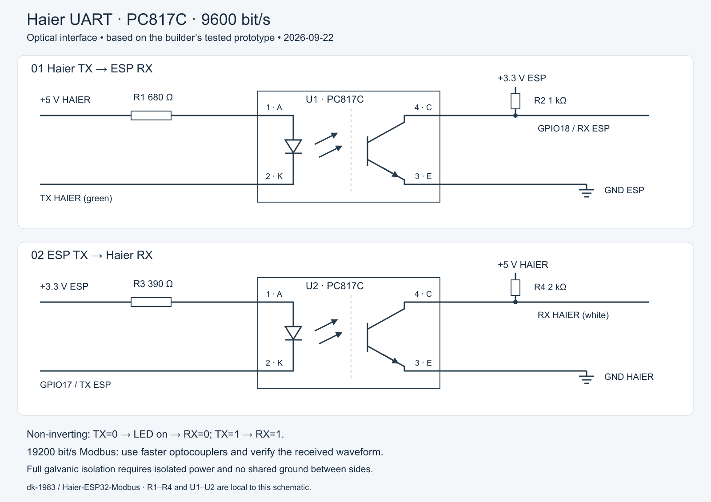

[English](OPTICAL-UART.md) | [Русский](OPTICAL-UART_RU.md)

# Optional optical Haier UART interface

[Vector SVG](assets/haier-uart-optical-en.svg) · [PNG](assets/haier-uart-optical-en.png) · [Author’s drawing](assets/haier-uart-optical-original.jpeg)

Redrawn from the author's 2026-09-22 drawing. The builder confirms successful communication on the optical bench at **9600 bit/s, 8N1**. This is an optional alternative to the main schematic's direct TX connection and RX divider, not a universal speed guarantee for every PC817 variant. GPIO17 TX and GPIO18 RX match `haier-s3.yaml`.

## Connections and values

PC817C pin numbering: **1 = anode, 2 = cathode, 3 = emitter, 4 = collector**. R1–R4 and U1–U2 are local designators for this drawing.

| Channel | LED side | Receiver side |
| --- | --- | --- |
| U1: Haier TX → ESP RX | Haier +5 V → R1 **680 Ω** → pin 1; pin 2 → Haier TX (green) | Pin 4 → **GPIO18**; R2 **1 kΩ** from this node to ESP +3.3 V; pin 3 → ESP GND |
| U2: ESP TX → Haier RX | ESP +3.3 V → R3 **390 Ω** → pin 1; pin 2 → **GPIO17** | Pin 4 → Haier RX (white); R4 **2 kΩ** from this node to Haier +5 V; pin 3 → Haier GND |

Wire colours describe the author's cable; verify other units independently. At TX LOW the output sinks LED current, turning on the phototransistor and pulling RX LOW. At TX HIGH the LED is off and the pull-up raises RX. **Both complete channels are non-inverting; no UART inversion is required.**

With an illustrative LED drop of 1.2 V and negligible TX LOW voltage, LED currents are approximately 5.6 mA (U1) and 5.4 mA (U2). Pull-up loads are approximately 3.3 mA and 2.5 mA, excluding internal receiver pull-ups. These are estimates, not measured limits; actual LED drop, driver capability and transistor saturation matter.

Install these channels **instead of** the direct GPIO17-to-Haier RX wire and Haier TX-to-GPIO18 divider. Do not retain the old divider or Zener across U1's output. The ESP receiver is pulled up to 3.3 V; only U2's Haier-side collector uses 5 V. The RS-485 section is unchanged.

## Oscilloscope result and speed limit

**Successful 9600 bit/s experiment**, as confirmed by the builder. The photo shows a visibly rounded rising edge on the cyan trace despite working communication. Horizontal scale is **500 µs/div**. A rise time of roughly 100 µs is only a visual estimate recalled by the builder, not a cursor measurement. The yellow `Rise <10.00us` readout is for CH1 and does not measure the cyan edge. This photo does not establish the exact resistor values fitted at that moment.

One bit lasts **104.2 µs at 9600** and **52.1 µs at 19200**. In a separate MAX485/Modbus test at **19200 bit/s**, the tested transistor optocouplers distorted short pulses by slowing the rising edge; bypassing the transmit optocoupler restored communication. **Do not use this slow-optocoupler circuit for 19200 bit/s Modbus: select faster optocouplers or a suitable digital isolator, then verify timing and logic levels under the actual load.**

At a collector output, a rising voltage corresponds to the phototransistor **turning off**. Turn-off/storage time, saturation and the pull-up/load capacitance can all contribute. The photo alone cannot isolate their contributions or establish a transistor turn-on time. Datasheet switching times under different loads must not be substituted for measurements of this circuit.

**Failed 19200 bit/s Modbus experiment**, identified by the builder. Yellow CH1 is MAX485 DI (pin 4); cyan CH2 is **GPIO21, RS-485 direction control**, not UART data. The cyan transition shows the direction change; assess data distortion on the yellow trace. At **100 µs/div**, the yellow pulses have a slow rising edge and almost no flat top: they reach their peak and immediately fall. Reaching the peak voltage does not preserve the time spent at a valid HIGH level. `Period=102 µs` is a period measurement, not rise time or a direct UART baud-rate measurement.

## Power and isolation

**Full galvanic isolation requires isolated power and no common ground between the two sides.** Powering ESP from Haier through the main schematic's LM1117 shares ground and bypasses the isolation barrier; the optical channels still transfer signals and adapt levels. Ordinary oscilloscope probe ground clips also share a common connection: do not use them to bridge intentionally isolated sides.

For an isolated Modbus design, consider RO, DI, direction control and power together; this two-channel drawing covers Haier UART only.

[Main schematic](SCHEMATIC.md) · [Hardware](HARDWARE.md) · [Earlier bench procedure and initial values](PC817-UART-BENCH.md) · [Sharp PC817 manufacturer datasheet (mirror)](https://pccomponents.com/datasheets/SHARP-PC8171.PDF)
