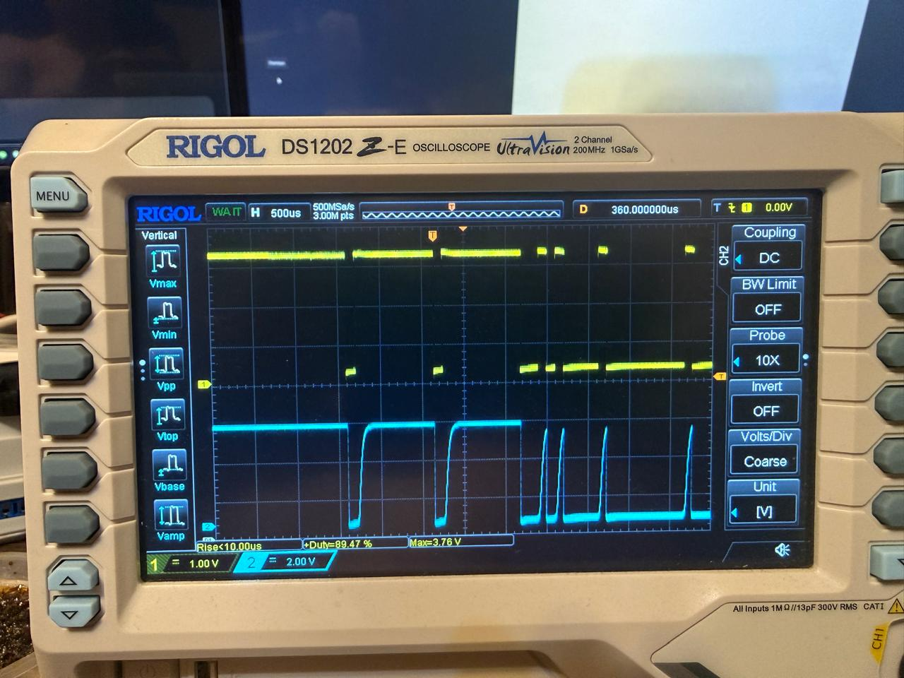
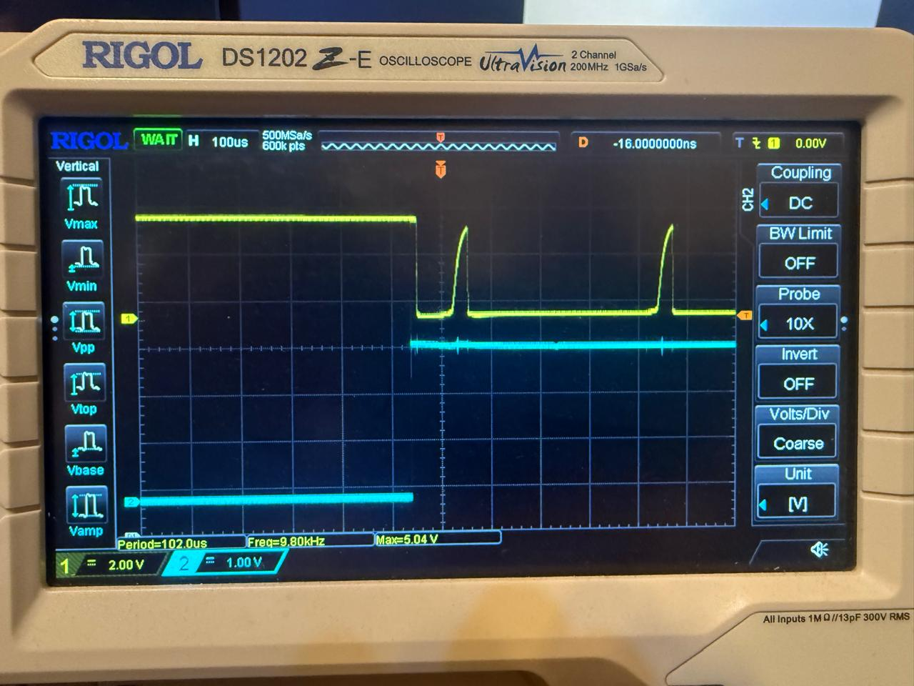

[English](OPTICAL-UART.md) | [Русский](OPTICAL-UART_RU.md)

# Оптический интерфейс UART Haier — дополнительный вариант

[Векторный SVG](assets/haier-uart-optical.svg) · [PNG](assets/haier-uart-optical.png) · [Рисунок автора](assets/haier-uart-optical-original.jpeg)

Перечерчено по рисунку автора от 22.09.2026. Автор подтверждает успешный обмен на оптическом стенде при **9600 бит/с, 8N1**. Это альтернатива прямому TX и делителю RX основной схемы, а не гарантия скорости для любого экземпляра PC817. GPIO17 TX и GPIO18 RX соответствуют `haier-s3.yaml`.

## Подключение и номиналы

Выводы PC817C: **1 — анод, 2 — катод, 3 — эмиттер, 4 — коллектор**. Обозначения R1–R4 и U1–U2 относятся только к этому рисунку.

| Канал | Сторона светодиода | Сторона приёмника |
| --- | --- | --- |
| U1: TX Haier → RX ESP | +5 В Haier → R1 **680 Ом** → вывод 1; вывод 2 → TX Haier (зелёный) | Вывод 4 → **GPIO18**; R2 **1 кОм** от этой точки к +3,3 В ESP; вывод 3 → GND ESP |
| U2: TX ESP → RX Haier | +3,3 В ESP → R3 **390 Ом** → вывод 1; вывод 2 → **GPIO17** | Вывод 4 → RX Haier (белый); R4 **2 кОм** от этой точки к +5 В Haier; вывод 3 → GND Haier |

Цвета относятся к кабелю автора; на другом кондиционере их нужно проверить. При TX LOW выход поглощает ток светодиода, фототранзистор открывается и притягивает RX к LOW. При TX HIGH светодиод выключен, подтяжка поднимает RX. **Оба канала в целом не инвертируют сигнал; программная инверсия UART не нужна.**

При условном падении на светодиоде 1,2 В и пренебрежимо малом напряжении TX LOW токи светодиодов составят около 5,6 мА (U1) и 5,4 мА (U2). Нагрузка подтяжек — около 3,3 мА и 2,5 мА без внутренних подтяжек приёмников. Это расчётные оценки, не измеренные пределы: важны фактическое падение на LED, нагрузочная способность передатчика и насыщение транзистора.

Эти каналы устанавливаются **вместо** прямого провода GPIO17 → RX Haier и делителя TX Haier → GPIO18. Старый делитель или стабилитрон параллельно выходу U1 не оставлять. Приёмник ESP подтянут к 3,3 В; 5 В используются только на коллекторе U2 со стороны Haier. Часть RS-485 не меняется.

## Осциллограмма и ограничение скорости

**Удачный эксперимент на 9600 бит/с**, по подтверждению автора. На голубой осциллограмме виден затянутый нарастающий фронт, несмотря на работающий обмен. Развёртка — **500 мкс/деление**. Время порядка 100 мкс — только приблизительная оценка по фото и воспоминанию автора, а не измерение курсорами. Жёлтая надпись `Rise <10.00us` относится к CH1 и не измеряет голубой фронт. Точные номиналы резисторов на момент снимка по фотографии установить нельзя.

Длительность одного бита — **104,2 мкс при 9600** и **52,1 мкс при 19200**. В отдельном испытании MAX485/Modbus на **19200 бит/с** проверенные транзисторные оптопары искажали короткие импульсы, заваливая нарастающий фронт; обход оптопары передающего канала восстановил обмен. **Для Modbus 19200 бит/с эту схему с медленными оптопарами применять нельзя: нужны более быстрые оптопары или подходящий цифровой изолятор, затем проверка уровней и временных характеристик при фактической нагрузке.**

На коллекторном выходе нарастание напряжения соответствует **закрыванию** фототранзистора. Вклад могут вносить время выключения и рассасывания заряда, насыщение и сочетание подтяжки с ёмкостью нагрузки. По одному фото нельзя разделить эти причины или определить время открывания транзистора. Паспортные времена переключения при другой нагрузке не заменяют измерение этой схемы.

**Неудачный опыт Modbus на 19200 бит/с**, по уточнению автора. Жёлтый CH1 — DI MAX485 (вывод 4); голубой CH2 — **GPIO21, управление направлением RS-485**, а не данные UART. Голубой переход показывает смену направления; искажение данных оценивается по жёлтому сигналу. При развёртке **100 мкс/деление** жёлтые импульсы имеют затянутый нарастающий фронт и почти лишены плоской вершины: достигнув пика, сигнал сразу падает. Достижение амплитуды не сохраняет длительность достоверной логической «1». `Period=102 µs` — измерение периода, а не времени нарастания или непосредственно скорости UART.

## Питание и развязка

**Полная гальваническая развязка требует изолированного питания и отсутствия общей земли между сторонами.** Питание ESP от Haier через LM1117 основной схемы объединяет земли и обходит барьер развязки; оптические каналы при этом передают сигналы и согласуют уровни. Земляные зажимы обычного осциллографа тоже соединены между собой: ими нельзя объединять намеренно разделённые стороны.

Для изолированного Modbus нужно совместно рассматривать RO, DI, управление направлением и питание; этот рисунок описывает только два канала UART Haier.

[Основная схема](SCHEMATIC_RU.md) · [Аппаратная часть](HARDWARE_RU.md) · [Ранний порядок проверки и начальные номиналы](PC817-UART-BENCH_RU.md) · [Паспорт Sharp PC817 (зеркало)](https://pccomponents.com/datasheets/SHARP-PC8171.PDF)
