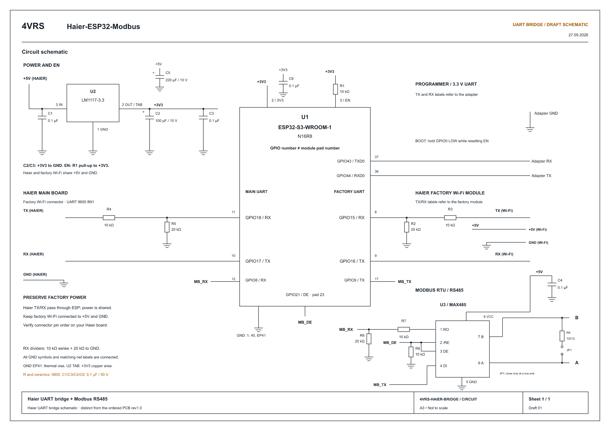

[English](UART_BRIDGE.md) | [Русский](UART_BRIDGE_RU.md)

# Factory Wi-Fi inline UART bridge

The `1.2.0` source adds a third UART so the ESP32 can sit between the indoor main board and the original Haier Wi-Fi module. The intended result is factory functionality plus our web controls, MQTT and Modbus. **The 30-minute coexistence run and physical factory-module removal/return tests passed on our Haier setup; see the current results below.** This does not establish support for every factory function or Haier model.

The architecture follows our [Samsung inline bridge](https://github.com/dk-1983/Samsung-ESP32-MQTT-Modbus). The packet decoder and arbitration here are specific to Haier hOn / HaierProtocol 0.9.31; Samsung packet counters and registers are not reused. Existing Haier Modbus addresses, MQTT topics/discovery and control semantics are retained.

## Current hardware results — 2026-09-27

Tested development image: `6a6ca7fb0ff119ab20f09670e3441d4e`, ESP32-S3 N16R8, Haier AS25HSL1HRA-W.

- **30-minute coexistence run (1800.1 s):** 5018 main-board frames, 4660 factory frames, 358 local requests and 358 replies. 39 preambles recovered; no unhandled UART errors, transaction/partial timeouts, overflows, reboots or HTTP failures. MQTT stayed connected without reconnects or dropped messages. COOL / 22 °C / LOW preserved.
- **Factory-module removal:** ESP remained running, detected factory silence and switched to direct polling (`factory_fallbacks=1`). A further 60-second observation received 12 replies to 12 local requests, with no new parser errors or timeouts. Display OFF and ON were each confirmed by two appliance status messages; the original display state and cooling settings were restored. MQTT remained connected.
- **Factory-module return:** automatically detected without resetting ESP. During 20 seconds of observation, 32 factory frames and 36 main-board frames were received; all four local requests received replies, with fresh appliance state and MQTT connectivity.
- **Switching observations:** factory-side parser count was 1 at the first removal check and 4 at the first reconnection check; the saved invalid byte was `00`. Neither observation period increased that count; main-board parser errors and timeouts remained zero. No immediately preceding measurement establishes the exact time or physical cause of those bytes.

The bridge fallback and return are now physically verified on this setup. This does not certify every factory function or model. Physical RS-485 on the new GPIO8/9 pins is deferred until the MAX485 board arrives. The public CI binary passed final command checks; see [v1.2.0 acceptance](VALIDATION-1.2.0.md). Earlier sections below retain the diagnostic history, not the current acceptance status.

## One firmware, two connection arrangements

With no factory module connected, the same firmware initializes and polls the air conditioner directly. The factory RX input has a pull-up so an unconnected input stays idle. A valid factory packet switches the bridge to shared operation; it then observes factory initialization/status and inserts local requests into idle gaps. After 60 seconds without a valid factory packet, and only when no frame/transaction is in flight, it returns to direct response handling. A new valid factory packet enables shared operation again. A stuck/shorted electrical line is not repaired by this fallback.

| ESP32-S3 pin | Function | Connection |
|---|---|---|
| GPIO17 | Main-board UART TX, unchanged | Haier RX |
| GPIO18 | Main-board UART RX, unchanged | Haier TX through existing level conversion |
| GPIO16 | Factory-module UART TX | Factory Wi-Fi RX |
| GPIO15 | Factory-module UART RX | Factory Wi-Fi TX through appropriate level conversion |
| GPIO9 | Modbus TX (previously GPIO15) | MAX485 DI, pin 4 |
| GPIO8 | Modbus RX (previously GPIO16) | MAX485 RO, pin 1, through level conversion |
| GPIO21 | Modbus direction, unchanged | DE and /RE; keep existing pull-down |

Both Haier links use **9600 8N1**. Modbus settings and register map are unchanged. UART serial logging is disabled (`logger.baud_rate: 0`) because all three hardware UARTs are occupied. UART0 programming remains available in the ROM bootloader; application diagnostics are available over HTTP.

Do not connect two TX outputs together. The factory module must connect to GPIO15/16, with its direct signal connection to the main board removed. Verify factory module supply requirements and signal levels; ESP32 inputs are not 5 V tolerant. Existing power/current capacity must also cover the factory module. Use common ground for a non-isolated connection.

**Ordered rev1.0 PCB/Gerbers and the published original schematic are unchanged.** Their Modbus traces use GPIO15/16. Rewire those traces before enabling RTU with this firmware. Existing direct Haier wiring on GPIO17/18 remains compatible; no RTU wiring is needed when RTU is disabled. Do not assume a stable v1.1.0 image supports the new wiring.

## Arbitration and limits

- Valid, unknown and damaged factory traffic is forwarded with its original bytes. Frames are buffered, so transparency is at the byte-content level, not exact timing. On the main-board input only, a single missing leading FF is restored after a complete CRC-enabled frame passes both checksum and CRC; recovered frames are counted separately. Frames with damaged contents or without CRC are not repaired.
- Startup guard: 5 seconds. Local injection also requires complete frames, no tracked factory transaction, and at least 80 ms of bus silence. Once a factory module is detected, a recognized status is required.
- The original module handles its own handshake, network-status exchanges and notification ACKs. Passive status updates feed the existing web/MQTT/Modbus model without completing our protocol command queue.
- In shared mode, local responses are matched by expected message type, status subtype, CRC mode and zero address/reserved fields, and are not forwarded to factory Wi-Fi. Requests arriving during a local transaction wait in a bounded 2 KiB buffer.
- Local answer timeout is 1 second. Factory transactions time out after 2 seconds; uncertain exchanges cause a further 2-second quarantine. Writes are not automatically retried in shared mode. Incomplete frames are forwarded after a 200 ms inter-byte timeout.
- Buffer overflow forwards held bytes and disables further local injection until reboot; it is a diagnostic fault, not an accepted operating condition.
- Detected appliance firmware-upgrade/baud-change traffic disables local injection until reboot. The bridge does **not** implement baud renegotiation: factory appliance OTA is not validated or supported by this revision. Our ESP32 OTA is a separate feature.

hOn frames used here have no unique transaction ID. A sufficiently late reply or an unsolicited status identical to an expected response can remain ambiguous. The guards reduce contention but cannot mathematically eliminate it. Factory timing, notification traffic, simultaneous controls and recovery must be checked on real hardware. Power loss/reset of the ESP32 interrupts the factory link: there is no hardware bypass.

## Diagnostics and acceptance order

`GET /haier/status` includes `uart_bridge`: factory detection, local busy state, passthrough-only state, main/factory frame counts, local request/reply counts, invalid frames, partial/transaction timeouts, buffer overflows and rejected transmissions. Counters reset on reboot. Factory fallback count and the most recent response header are included. These transport diagnostics are omitted from the MQTT state payload. In direct mode, response acceptance remains with HaierProtocol: the tested appliance already enables CRC in its version response to a request without CRC.

1. Save current cooling/settings and keep a verified rollback OTA image.
2. Update the existing direct-connected board **without attaching factory Wi-Fi**. Confirm serial status, web controls, MQTT, existing Modbus functionality and OTA; restore initial cooling/settings.
3. Only after that regression gate passes, rewire/connect the factory module and repeat our functional checks alongside factory pairing/app controls.
4. Test concurrent controls, factory power cycling, missing/corrupt replies and ESP32 restart. Record failures and response timing before calling this a stable bridge release.

Automated checks: `python tools/test_host.py`, `python tests/test_discovery.py`, `python tools/test_hon_simulator.py` (after a firmware build installs HaierProtocol). Tests cover direct mode, frame forwarding, stuffing/checksums/CRC, ownership, queued factory requests, late replies, notifications, overflow and clock wrap; the real HaierProtocol engine is also exercised against the bench simulator. Software checks do not replace the physical acceptance steps above.

## Direct-mode acceptance — 2026-09-27

Development build `1.1.1`, image MD5 `00814912bebd5c64eb8b81eb9f1b80d4`, was installed by OTA on the operating S3 controller, without factory Wi-Fi connected. The following passed against actual appliance status:

- 17 MQTT commands, including target, fan, swing, preset, quiet, display, vane positions and idempotent power-on; Discovery/state delivery, retained-command rejection and invalid-temperature rejection.
- 16 web commands, plus Modbus TCP reads (FC1/3/4), writes (FC5/6/15/16), and invalid-value/address/function exceptions.
- Original MQTT configuration, disabled Modbus configuration and cooling settings were restored: COOL, 22 °C, AUTO fan, swing OFF, preset NONE, quiet OFF, display ON, vanes CENTER.

During the MQTT test the transport accumulated 45 invalid-parser events and one transaction timeout. Communication recovered and every tested command was confirmed. Those counters did not increase during the subsequent full web/TCP test. The cause has not been isolated; this is **not** an error-free transport certification. There were no buffer overflows or Wi-Fi outages in the recorded run.

Power-off, heating and drying were not exercised in this run because the appliance cools an operating server room. Physical RS-485 was not connected. Factory coexistence and physical loss/reconnection of the factory module remain untested; the 60-second fallback is currently covered by software tests only.

## First factory-module bench connection — 2026-09-27

With the original module physically connected through GPIO15/16, factory traffic was detected and counters increased in both directions. All 16 web commands and the Modbus TCP read/write/exception regression passed; original COOL / 22 °C / AUTO settings and disabled Modbus configuration were restored. This was the previously installed development image `1.1.1`, not a published `1.2.0` release.

Acceptance remains incomplete: invalid-parser events increased from 45 to 118 and transaction timeouts from 1 to 4 across the command run and following passive observation. Errors also occurred without new user control commands; automatic polling remained active. The existing combined counters cannot identify the affected UART or establish the cause. Buffer overflows remained zero and appliance status continued updating. Factory cloud pairing/control and recovery tests are still pending.

## Delimiter-loss diagnostics — 2026-09-27

The factory input remained free of parser errors while the main-board input occasionally delivered a frame with only one leading `FF`. A captured example was `FF 0E 40 00 00 00 00 00 FD 00 00 00 00 00 00 4B C1 DD`: apart from the missing delimiter, its length, checksum and CRC match a complete keep-alive reply. The loss is visible before the bridge parser; this does not establish whether the origin is appliance transmission, electrical reception or the UART driver.

Setting the main UART RX threshold to one byte makes activity visible promptly, but did not eliminate the loss in an A/B test (it recurred after 124 seconds). The development firmware therefore adds bounded recovery on **main-board RX only**: collect the entire frame, require CRC mode and validate both integrity checks, then restore the missing delimiter for HaierProtocol/factory forwarding. Never accept a corrupt body or a checksum-only short frame. `recovered_preambles` reports every repair; it is separate from parser errors (the normal received-frame total includes recovered valid frames). `invalid_main`, `invalid_factory`, local/pending timeout counters and a bounded rejected-frame capture identify failures that remain.

Tests include the real captured reply, bad CRC, missing body byte, absent CRC, strict factory-input parsing and recovery of subsequent valid frames. The user also confirmed successful EVO pairing, completion of the factory update and a factory-app setpoint change reflected in our ESP state. No factory firmware payload was captured; the update target and all factory OTA paths are not independently validated.

### Live recovery result

Development image MD5 `abc06d9f4eb1d032115e3828ca6f9d32` ran for 321 seconds after OTA. The final snapshot recorded 579 main-board frames, 515 factory frames and **3 recovered preambles**, with **0 invalid frames, 0 transaction/partial timeouts and 0 buffer overflows**. This exercises the recovery path on real hardware as well as in tests. A single HTTP connection timeout from the test PC occurred; subsequent requests succeeded and the ESP reported no Wi-Fi outages or reboot. MQTT remained connected. No diagnostic control commands were sent during this observation; the user's 23 °C automation test was left untouched. This is a short acceptance run, not a guarantee of long-term reliability or proof of the physical cause of delimiter loss.

## Extended-delimiter recovery — 2026-09-27

The 1800.2-second run of image `abc06d9f4eb1d032115e3828ca6f9d32` recorded 3219 main-board frames, 2867 factory frames, 365/365 local requests/replies and 26 recovered short preambles. It also recorded 56 parser-error events in two bursts and two factory transaction timeouts; these are not 56 lost packets. No local/partial timeouts, overflows, reboots or MQTT reconnects were recorded. One HTTP request from the test PC failed.

Both rejected captures began with three `FF` bytes. The next development image, `6a6ca7fb0ff119ab20f09670e3441d4e`, normalizes one extra delimiter on main-board RX only, after validating the full checksum and CRC. Normal escaped length 255 is preserved; ambiguous or unsupported prefixes are not guessed. Invalid packets retain their original bytes. The origin of the extra byte remains unproven.

Regression tests replay both exact captures (ACK and status), reject bad CRC/no-CRC repair and multiple extra delimiters, preserve maximum-length stuffing, and verify factory/local ownership. The real HaierProtocol test completes 20 polls alternating missing and extra delimiters. Host suites and firmware compilation passed. OTA boot, factory detection and live appliance status were confirmed; the repeated 30-minute run has completed; see the current results above. This is not a released build. RS-485 hardware acceptance remains pending; factory removal/return is now verified above.

## Draft bridge schematic

[Editable SVG](assets/haier-uart-bridge-schematic.svg). Adapted from the latest Samsung project schematic for Haier, with the pin assignments above, RX dividers, GPIO21 pull-down, supply bypass capacitors and switchable 120 Ω termination. Component references belong to this drawing, not the ordered rev1.0 PCB. This is a circuit draft for review; connector footprints and the new PCB layout follow the firmware release. The existing PCB/Gerbers are unchanged.
