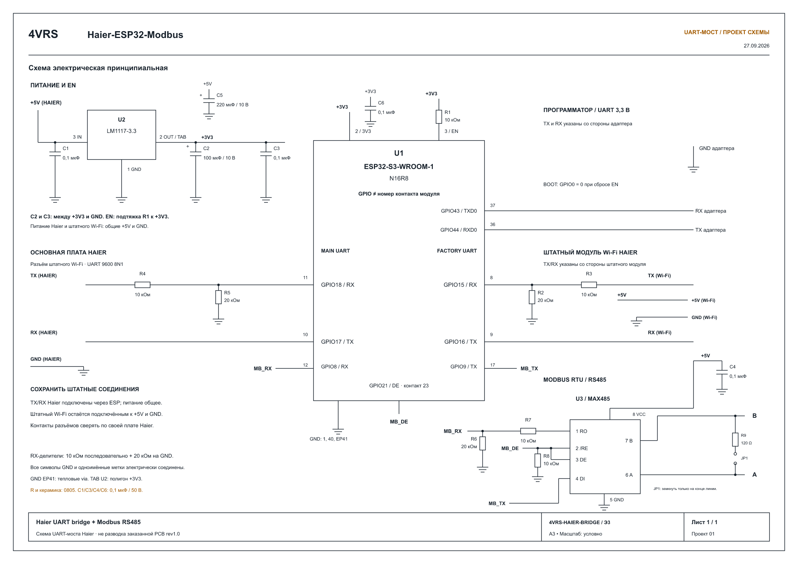

[English](UART_BRIDGE.md) | [Русский](UART_BRIDGE_RU.md)

# UART-мост для штатного Wi-Fi (разработка)

В исходниках `1.2.0` добавлен третий UART: ESP32 можно включить между материнской платой внутреннего блока и оригинальным Wi-Fi-модулем Haier. Цель — сохранить заводские функции и дополнить их нашим веб-управлением, MQTT и Modbus. **30-минутный прогон и физическое отключение/возвращение штатного модуля прошли на нашей установке Haier; актуальные результаты приведены ниже.** Это не стабильный релиз и не заявление о поддержке всех заводских функций.

Архитектура основана на нашем [мосте Samsung](https://github.com/dk-1983/Samsung-ESP32-MQTT-Modbus). Декодер и арбитраж здесь реализованы для Haier hOn / HaierProtocol 0.9.31; счётчики пакетов и регистры Samsung не переносятся. Существующие адреса Modbus, MQTT-топики/Discovery и смысл команд Haier сохранены.

## Актуальные аппаратные результаты — 27.09.2026

Проверенный образ разработки: `6a6ca7fb0ff119ab20f09670e3441d4e`, ESP32-S3 N16R8, Haier AS25HSL1HRA-W.

- **30 минут совместной работы (1800,1 с):** 5018 пакетов основной платы, 4660 пакетов штатного модуля, 358 наших запросов и 358 ответов. Восстановлены 39 преамбул; необработанных ошибок UART, таймаутов транзакций/неполных кадров, переполнений, перезапусков и ошибок HTTP нет. MQTT оставался подключённым без переподключений и отброшенных сообщений. Сохранены COOL / 22 °C / LOW.
- **Отключение штатного модуля:** ESP продолжила работать и перешла на самостоятельный опрос после обнаружения тишины (`factory_fallbacks=1`). За дополнительные 60 секунд наблюдения получены 12 ответов на 12 наших запросов без новых ошибок разбора и таймаутов. Выключение и включение дисплея подтверждены двумя сообщениями состояния каждая команда; исходное состояние дисплея и охлаждение восстановлены. MQTT подключён.
- **Возвращение штатного модуля:** автоматическое обнаружение без перезапуска ESP. За 20 секунд наблюдения получены 32 пакета штатного модуля и 36 пакетов основной платы; все четыре наших запроса получили ответы, состояние кондиционера свежее, MQTT подключён.
- **Наблюдения при переключении:** в первом замере после отключения счётчик ошибок входа штатного модуля равнялся 1, в первом замере после возвращения — 4; сохранён байт `00`. Во время обоих наблюдений счётчик не увеличивался; ошибок входа основной платы и таймаутов нет. Непосредственного замера перед переключениями нет, поэтому точное время и физическая причина этих байтов не установлены.

Переход на самостоятельный опрос и возврат моста аппаратно подтверждены на этой установке. Это не сертификация всех заводских функций и моделей. Физический RS-485 на новых GPIO8/9 отложен до получения платы MAX485. Публичные CI-бинарники ещё предстоит собрать и принять; v1.2.0 не опубликована. Разделы ниже сохраняют историю диагностики, а не текущий статус приёмки.

## Одна прошивка, два варианта подключения

Без штатного модуля эта же прошивка самостоятельно инициализирует и опрашивает кондиционер. На входе UART штатного модуля включена подтяжка вверх, чтобы свободный вход оставался в состоянии покоя. Корректный пакет штатного модуля переводит мост в совместный режим: он наблюдает штатную инициализацию/состояние и вставляет наши запросы в свободные интервалы. Через 60 секунд без корректного штатного пакета, только после завершения всех пакетов/транзакций, включается прямая обработка ответов. Новый корректный штатный пакет снова включает совместный режим. Замкнутую или электрически зажатую линию этот механизм не исправляет.

| Вывод ESP32-S3 | Назначение | Подключение |
|---|---|---|
| GPIO17 | TX UART материнской платы, без изменений | RX Haier |
| GPIO18 | RX UART материнской платы, без изменений | TX Haier через прежнее согласование уровней |
| GPIO16 | TX UART штатного модуля | RX заводского Wi-Fi |
| GPIO15 | RX UART штатного модуля | TX заводского Wi-Fi через соответствующее согласование уровней |
| GPIO9 | TX Modbus, раньше GPIO15 | DI MAX485, ножка 4 |
| GPIO8 | RX Modbus, раньше GPIO16 | RO MAX485, ножка 1, через согласование уровней |
| GPIO21 | Направление Modbus, без изменений | DE и /RE; прежнюю подтяжку к земле сохранить |

Оба UART Haier работают на **9600 8N1**. Параметры Modbus и карта регистров не меняются. Последовательный журнал выключен (`logger.baud_rate: 0`), поскольку заняты все три аппаратных UART. Программирование через UART0 в ROM-загрузчике остаётся доступным; диагностика приложения доступна по HTTP.

Нельзя соединять два выхода TX. Заводской модуль подключается к GPIO15/16 вместо прямого сигнального соединения с материнской платой. Проверьте питание и уровни его сигналов: входы ESP32 не допускают 5 В. Источник питания должен выдерживать и дополнительную нагрузку штатного модуля. При соединении без гальванической развязки нужна общая земля.

**Заказанные PCB/Gerber rev1.0 и опубликованная исходная схема не изменены.** На них Modbus разведен на GPIO15/16. Перед включением RTU с этой прошивкой эти соединения необходимо переделать. Прямое подключение Haier на GPIO17/18 совместимо; при отключённом RTU его монтаж не нужен. Стабильный образ v1.1.0 не поддерживает новую распиновку автоматически.

## Арбитраж и ограничения

- Корректный, неизвестный и повреждённый штатный трафик передаётся с исходными байтами. Пакеты буферизуются: прозрачность относится к содержимому, а не к точному времени передачи. Исключение на входе материнской платы — восстановление одного отсутствующего начального FF после проверки полного пакета с CRC и контрольной суммой; оно учитывается отдельно. Пакеты с повреждённым содержимым или без CRC не исправляются.
- Стартовая пауза — 5 секунд. Для нашей передачи также нужны завершённые пакеты, отсутствие незавершённого штатного обмена и минимум 80 мс тишины. После обнаружения штатного модуля требуется распознанный статус.
- Заводской модуль сам выполняет инициализацию, обмен сетевым состоянием и подтверждение уведомлений. Пассивно принятые статусы обновляют прежнюю модель веб/MQTT/Modbus, но не завершают нашу очередь протокольных команд.
- В совместном режиме наши ответы сопоставляются по типу сообщения, подтипу статуса, режиму CRC и нулевым адресным/резервным полям; они не передаются штатному Wi-Fi. Его запросы во время нашей транзакции ждут в ограниченном буфере 2 КиБ.
- Таймаут нашего ответа — 1 секунда. Штатная транзакция ожидается 2 секунды; неопределённый обмен вызывает дополнительную паузу 2 секунды. Записи в совместном режиме автоматически не повторяются. Незавершённые пакеты пересылаются после межбайтовой паузы 200 мс.
- При переполнении накопленные байты передаются дальше, а наши передачи запрещаются до перезапуска. Это диагностическая ошибка, а не нормальный рабочий режим.
- Обнаружение обмена обновления кондиционера/смены скорости запрещает наши передачи до перезапуска. Согласование новой скорости мост **не реализует**: заводское OTA кондиционера этой версией не поддерживается и не проверено. OTA самой ESP32 — отдельная функция.

В используемых hOn-пакетах нет уникального номера транзакции. Очень поздний ответ или самопроизвольный статус, совпавший с ожидаемым, могут оставаться неоднозначными. Паузы уменьшают конкуренцию, но не устраняют её математически. Штатные тайминги, уведомления, одновременное управление и восстановление требуют аппаратной проверки. Потеря питания/перезапуск ESP32 прерывает заводскую связь: аппаратного обхода нет.

## Диагностика и порядок приёмки

`GET /haier/status` содержит `uart_bridge`: обнаружение заводского модуля, занятость нашей транзакцией, режим только пересылки, количество пакетов двух сторон, наших запросов/ответов, повреждений, таймаутов фрагментов/транзакций, переполнений и отклонённых передач. Счётчики обнуляются при перезапуске. Также доступны число возвратов к прямой обработке и последний заголовок ответа. В MQTT-состояние транспортная диагностика не включается. В прямом режиме приём ответов оставлен HaierProtocol: проверенный кондиционер включает CRC уже в ответе на запрос версии без CRC.

1. Сохранить исходное охлаждение/настройки и проверенный OTA-образ для возврата.
2. Обновить существующую плату с прямым подключением, **без штатного Wi-Fi**. Проверить получение состояния, веб-управление, MQTT, прежний функционал Modbus и OTA; вернуть исходное охлаждение/настройки.
3. Только после успешной регрессии переделать подключение заводского модуля и повторить наши проверки вместе со штатным сопряжением/управлением из приложения.
4. Проверить одновременные команды, перезапуск заводского модуля, пропуски/повреждения ответов и перезапуск ESP32. Зафиксировать ошибки и тайминги перед объявлением стабильного релиза моста.

Автоматические проверки: `python tools/test_host.py`, `python tests/test_discovery.py`, `python tools/test_hon_simulator.py` (после сборки прошивки, устанавливающей HaierProtocol). Проверяются прямой режим, пересылка, экранирование/контрольные суммы/CRC, принадлежность ответов, очередь штатных запросов, поздние ответы, уведомления, переполнение и переполнение таймера; настоящий HaierProtocol также проверяется с имитатором. Программные проверки не заменяют аппаратную приёмку выше.

## Проверка прямого режима — 2026-09-27

Тестовая сборка `1.1.1`, MD5 образа `00814912bebd5c64eb8b81eb9f1b80d4`, установлена по OTA на работающий S3-контроллер без подключения штатного Wi-Fi. По реальным ответам кондиционера успешно проверены:

- 17 MQTT-команд: температура, вентилятор, качание, пресеты, тихий режим, дисплей, положения жалюзи и повторное включение уже работающего прибора; доставка Discovery/состояния, отклонение сохранённой команды retain и недопустимой температуры.
- 16 веб-команд, чтение Modbus TCP (FC1/3/4), запись (FC5/6/15/16), исключения для недопустимого значения, адреса и функции.
- Восстановлены исходные настройки MQTT, отключённый Modbus и охлаждение: COOL, 22 °C, вентилятор AUTO, качание OFF, пресет NONE, тихий режим OFF, дисплей ON, жалюзи CENTER.

За время MQTT-теста транспорт накопил 45 событий некорректного разбора входных данных и один таймаут транзакции. Связь восстановилась, все проверяемые команды подтверждены. При последующей полной проверке веба/TCP эти счётчики больше не росли. Причина пока не установлена; это **не** подтверждение полностью безошибочного транспорта. Переполнений буфера и обрывов Wi-Fi в записанном прогоне не было.

Выключение, обогрев и осушение в этом прогоне не проверялись: кондиционер охлаждает работающую серверную. Физический RS-485 не подключён. Совместная работа со штатным модулем и его физическое отключение/возвращение ещё не проверены; возврат через 60 секунд пока покрыт только программными тестами.

## Первое подключение штатного модуля — 2026-09-27

После физического подключения оригинального модуля через GPIO15/16 обнаружен штатный обмен, счётчики пакетов растут в обе стороны. Успешно прошли все 16 веб-команд и регрессия чтения/записи/исключений Modbus TCP; восстановлены COOL / 22 °C / AUTO и отключённый Modbus. Проверялась ранее установленная тестовая сборка `1.1.1`, а не опубликованный релиз `1.2.0`.

Приёмка ещё не завершена: за прогон команд и последующее пассивное наблюдение счётчик некорректного разбора вырос с 45 до 118, таймаутов — с 1 до 4. Ошибки появлялись и без новых управляющих команд пользователя; автоматический опрос продолжался. Имеющиеся общие счётчики не позволяют определить проблемный UART или причину. Переполнений буфера нет, состояние кондиционера продолжает обновляться. Привязка/управление через заводское облако и проверки восстановления ещё предстоят.

## Диагностика потери разделителя — 2026-09-27

На входе от штатного модуля ошибок разбора не было, а на входе от материнской платы иногда появлялся пакет только с одним начальным `FF`. Захвачен пример `FF 0E 40 00 00 00 00 00 FD 00 00 00 00 00 00 4B C1 DD`: кроме отсутствующего разделителя, длина, контрольная сумма и CRC соответствуют полному ответу keep-alive. Потеря видна до декодера моста; это ещё не определяет её источник — передачу кондиционера, электрический приём или драйвер UART.

Порог RX основного UART снижен до одного байта, чтобы сразу видеть активность линии, но сравнение показало, что сама потеря осталась (повторилась через 124 секунды). Поэтому в разработку добавлено ограниченное восстановление **только на RX от материнской платы**: получить полный пакет, потребовать режим CRC и проверить обе контрольные суммы, затем вернуть отсутствующий разделитель перед передачей в HaierProtocol/штатному модулю. Повреждённое содержимое и укороченные пакеты без CRC не принимаются. Каждое восстановление отражается в `recovered_preambles`, отдельно от счётчиков ошибок; нормальные пакеты пересылаются без изменения байтов. `invalid_main`, `invalid_factory`, счётчики наших/штатных таймаутов и ограниченный захват отклонённого пакета помогают разбирать оставшиеся сбои.

Тесты включают реальный захваченный ответ, испорченный CRC, потерянный байт содержимого, отсутствие CRC, строгий разбор входа штатного модуля и приём следующих корректных пакетов. Пользователь также подтвердил успешную привязку EVO, завершение заводского обновления и изменение уставки из штатного приложения, отражённое в состоянии нашей ESP. Содержимое заводского обновления не захватывалось; его адресат и все варианты заводского OTA независимо не проверены.

### Результат аппаратной проверки восстановления

Тестовый образ с MD5 `abc06d9f4eb1d032115e3828ca6f9d32` проработал 321 секунду после OTA. Последний снимок: 579 пакетов от материнской платы, 515 от штатного модуля, **3 восстановленных разделителя**, при этом **0 некорректных пакетов, 0 таймаутов транзакций/фрагментов, 0 переполнений буфера**. Ветка восстановления проверена на настоящем оборудовании, а не только тестами. Один HTTP-запрос с тестового ПК завершился таймаутом соединения; следующие прошли, ESP не зафиксировала обрыва Wi-Fi или перезапуска. MQTT подключён. Во время наблюдения диагностические управляющие команды не отправлялись; пользовательскую проверку автоматики с уставкой 23 °C не меняли. Это короткий приёмочный прогон, не гарантия долговременной надёжности и не установление физической причины потери разделителя.

## Восстановление лишнего разделителя — 27.09.2026

Прогон образа `abc06d9f4eb1d032115e3828ca6f9d32` длился 1800,2 с: 3219 пакетов основной платы, 2867 пакетов штатного Wi-Fi, 365/365 наших запросов/ответов и 26 восстановленных коротких преамбул. Зарегистрированы 56 событий ошибки разбора в двух эпизодах и два таймаута штатного обмена; это не 56 потерянных пакетов. Наших таймаутов, таймаутов неполных кадров, переполнений, перезапусков и переподключений MQTT не зарегистрировано. Один HTTP-запрос проверяющего ПК завершился ошибкой.

Оба отвергнутых пакета начинались с трёх байтов `FF`. Следующий образ разработки `6a6ca7fb0ff119ab20f09670e3441d4e` убирает один лишний разделитель только на RX основной платы и только после проверки полной контрольной суммы и CRC. Штатное экранирование длины 255 сохранено; неоднозначные и неподдерживаемые префиксы не угадываются. Невалидные пакеты сохраняют исходные байты. Источник лишнего байта пока не установлен.

Регрессионные тесты воспроизводят оба захвата (ACK и статус), запрещают восстановление при плохой CRC, без CRC и при нескольких лишних разделителях, проверяют максимальную длину с экранированием и принадлежность ответов. Тест с настоящей HaierProtocol завершает 20 опросов с чередованием отсутствующего и лишнего разделителя. Локальные тесты и сборка прошли. После OTA подтверждены запуск, обнаружение штатного модуля и обновление состояния кондиционера; повторный 30-минутный прогон завершён; см. актуальные результаты выше. Релиз не опубликован. Аппаратная проверка RS-485 остаётся впереди; отключение и возвращение штатного Wi-Fi подтверждены выше.

## Проект схемы UART-моста

[Редактируемый SVG](assets/haier-uart-bridge-schematic_RU.svg). Адаптирована актуальная схема проекта Samsung: распиновка Haier из таблицы выше, делители RX, подтяжка GPIO21 к земле, развязка питания конденсаторами и отключаемый терминатор 120 Ом. Позиционные обозначения относятся к этому чертежу, а не к заказанной PCB rev1.0. Это проект электрической схемы для проверки; посадочные места разъёмов и новая разводка платы — после релиза прошивки. Существующая PCB и Gerber не изменены.
